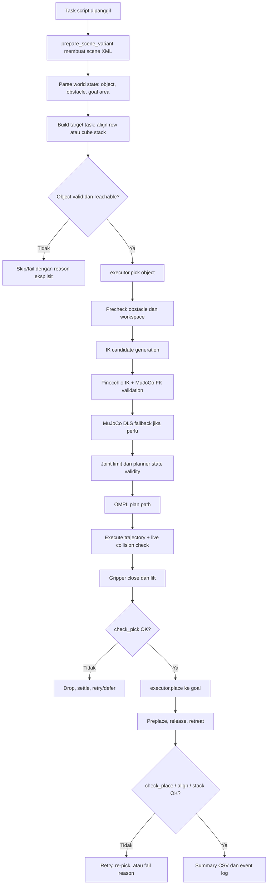
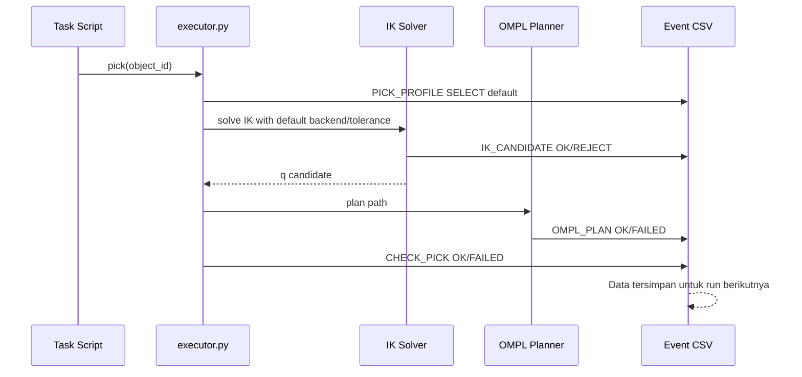
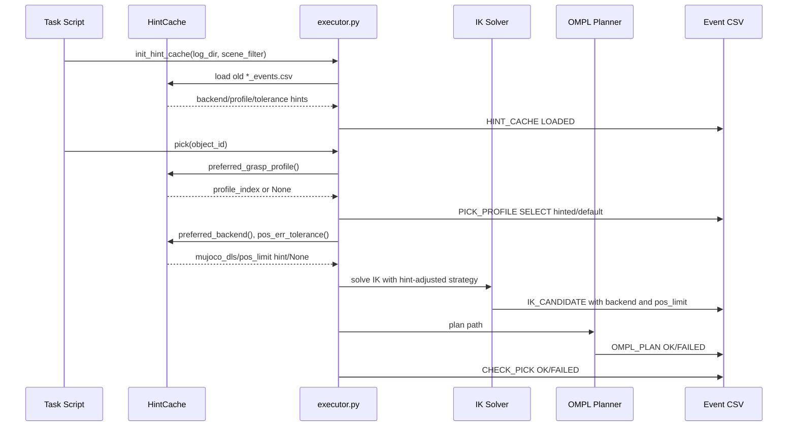
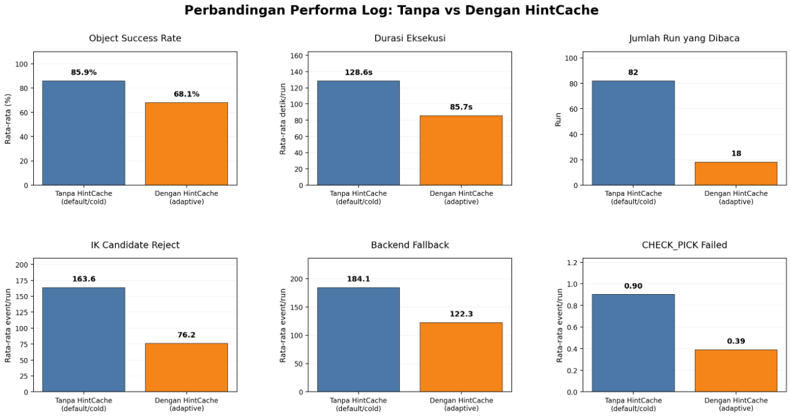
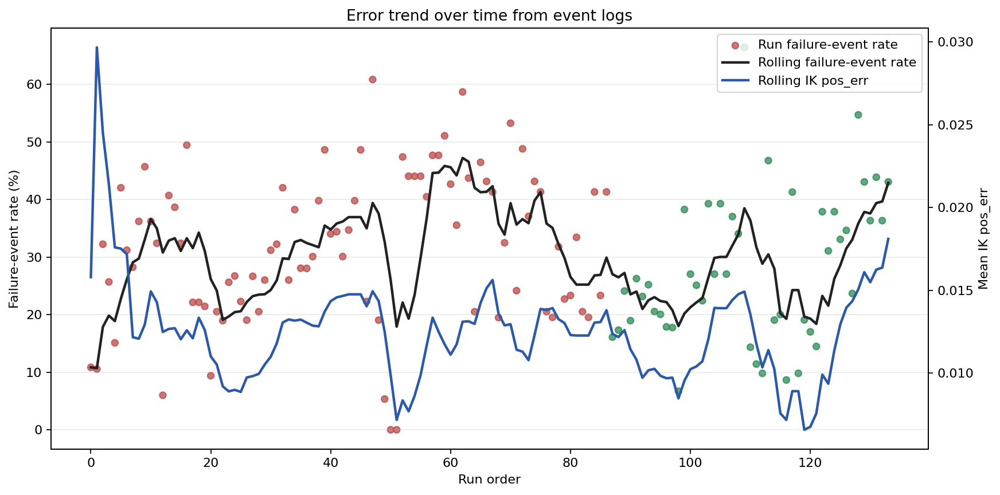
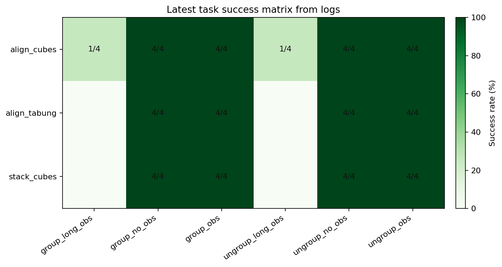
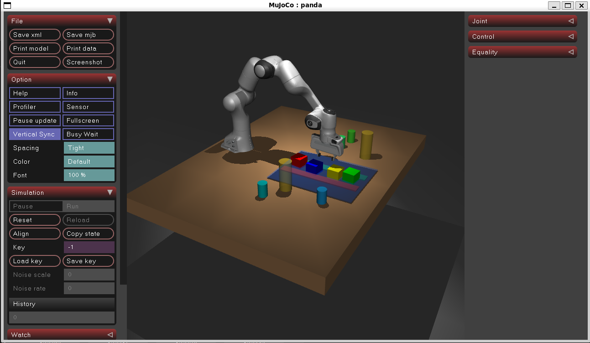
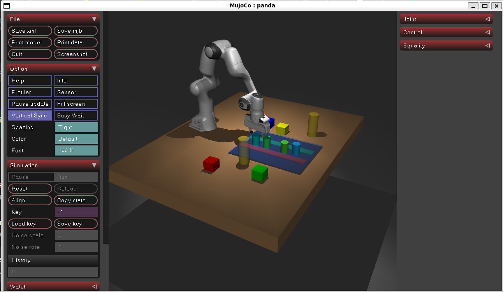
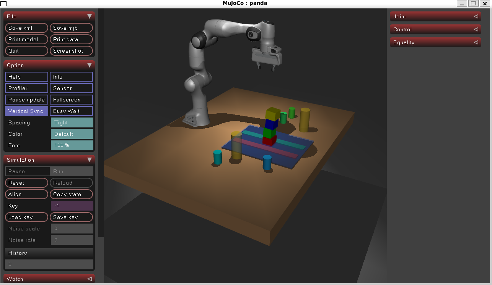

# Laporan MVP CTAMP Robot V2

Repository ini berisi simulasi robot arm Franka Panda untuk task pick and place
berbasis MuJoCo, Pinocchio IK, OMPL motion planning, collision policy, feedback
validation, dan HintCache. Fokus MVP adalah menjalankan task object manipulation
secara terukur pada scene static:

- Align cubes: menyusun 4 kubus sejajar pada goal area.
- Align tabung: menyusun 4 silinder/tabung sejajar pada goal area.
- Stack cubes: menyusun 4 kubus menjadi satu tower 4 lapisan.
- Separate groups: memisahkan object berdasarkan kelompok target.

Raw `logs/`, cache pytest, notebook lama, SVG matriks lama, dan output notebook
lama sudah dibersihkan. Mesh di `assets/` tetap dipertahankan karena dibutuhkan
oleh MuJoCo model.

## 1. Pengenalan Pipeline Robot

Secara garis besar, pipeline robot tidak menggerakkan arm langsung dari satu
koordinat ke koordinat lain. Setiap aksi melewati rangkaian validasi: scene
dibuat, target object dipilih, reachability dicek, IK menghasilkan kandidat
joint, MuJoCo memvalidasi FK/state, OMPL merencanakan jalur, trajectory
dieksekusi dengan collision checking, lalu feedback memastikan object benar
terangkat atau benar diletakkan.



kode utama:

| Tahap | Lokasi kode | Peran |
|---|---|---|
| Scene generation | `scripts/ctamp_task_utils.py:177` | `prepare_scene_variant()` membuat XML scene sesuai kondisi task. |
| Align cube target | `scripts/align_cubes_ompl_only.py:394` | `_build_aligned_cube_targets()` memilih cube dan target row. |
| Align tabung target | `scripts/align_tabung_ompl_only.py:51` | `_build_aligned_cylinder_targets()` memilih tabung dan target row. |
| Stack target | `scripts/stack_cubes_ompl_only.py:65` | `_build_cube_stack_targets()` membuat tower 4 layer. |
| Pick action | `src/executor.py:1522` | `pick()` menjalankan pregrasp, grasp, grip close, lift. |
| Place action | `src/executor.py:1792` | `place()` menjalankan preplace, release, retreat. |
| IK ranking | `src/executor.py:916` | `_ranked_ik_goals()` membuat dan memvalidasi kandidat IK. |
| OMPL plan | `src/executor.py:1130` | `_move_with_ompl()` merencanakan path joint-space. |
| Trajectory execution | `src/executor.py:1043` | `_execute_joint_trajectory()` mengeksekusi waypoint dan cek collision. |
| Collision policy | `src/collision_policy.py:42` | `CollisionPolicy` mengklasifikasi contact valid/tidak valid. |
| Feedback | `src/feedback.py:18`, `src/feedback.py:54` | `check_pick()` dan `check_place()` memvalidasi hasil aksi. |
| HintCache | `src/hint_cache.py:78` | `HintCache` membaca event log lama untuk hint backend/profile/toleransi. |

## 2. Setup Instalasi

### Setup WSL Ubuntu 22.04 dari Windows

```powershell
wsl -d Ubuntu-22.04
```

```bash
cd /mnt/c/projek
git clone https://github.com/rafasoelistiono/MVP-CTAMP-ROBOT-V2.git MVP-CTAMP-ROBOT
cd MVP-CTAMP-ROBOT
python3 -m venv .venv
source .venv/bin/activate
python -m pip install --upgrade pip
pip install -r requirements.txt
cp .env.example .env
python -m pytest -q
```

Validasi dependency:

```bash
python -c "from ompl import base, geometric; print('ompl ok')"
python -c "import mujoco; print('mujoco ok')"
python -c "import pinocchio, robot_descriptions; print('pinocchio ok')"
```

### Setup Native Linux

```bash
git clone https://github.com/rafasoelistiono/MVP-CTAMP-ROBOT-V2.git
cd MVP-CTAMP-ROBOT-V2
python3 -m venv .venv
source .venv/bin/activate
python -m pip install --upgrade pip
pip install -r requirements.txt
cp .env.example .env
python -m pytest -q
```

Jika `pip install ompl` gagal di distro tertentu, install OMPL Python binding
melalui package/source build Linux lalu pastikan import ini berhasil:

```bash
python -c "from ompl import base, geometric; print('ompl ok')"
```

### Isi `.env.example`

```dotenv
# Simulation
MODEL_FILE=models/panda.xml
ENABLE_VIEWER=true

# OMPL motion planning
IK_BACKEND=auto
IK_REQUIRE_PINOCCHIO=false
IK_PLAN_POS_ERR_LIMIT=0.020
IK_PREGRASP_POS_ERR_LIMIT=0.030
IK_PLAN_ORI_ERR_LIMIT=0.35
IK_PREGRASP_ORI_ERR_LIMIT=0.50
MAX_VALID_IK_CANDIDATES=6
MAX_IK_ATTEMPTS_PER_SEGMENT=80
MIN_PICK_OBJECT_Z=0.70
MAX_PICK_OBJECT_XY_DISTANCE=0.92
OMPL_ENABLED=true
OMPL_REQUIRED=false
OMPL_PLANNER_NAME=RRTConnect
OMPL_FRAGILE_PLANNER_NAME=BITstar
OMPL_TIME_LIMIT=6.0
OMPL_STATE_VALIDITY_RESOLUTION=0.004
OMPL_SAMPLER_RANGE=0.08
OMPL_WAYPOINT_STEP=0.010
OMPL_GOAL_TOLERANCE=0.001

# Execution safety
USE_IK_FALLBACK=false
SETTLE_STEPS_PER_WAYPOINT=14
FINAL_SETTLE_STEPS=40
MIN_PICK_OBSTACLE_CLEARANCE=0.18
CAUTIOUS_OBSTACLE_CLEARANCE=0.24
FINGER_MOVABLE_CONTACT_TOLERANCE=0.018
TABLE_FINGER_CONTACT_TOLERANCE=0.005
CYLINDER_RETRY_MIN_GRASP_OFFSET=0.095
CYLINDER_TIPPED_CENTER_Z=0.832
CYLINDER_TIPPED_GRASP_OFFSET=0.075
CYLINDER_TIPPED_GRIP=0.010
ALLOW_MOVABLE_OBJECT_CONTACT=false
```

### Fungsi Setiap Env

| Env | Fungsi |
|---|---|
| `MODEL_FILE` | File XML MuJoCo yang dimuat oleh executor. Task script biasanya mengisi ini otomatis dari scene variant. |
| `ENABLE_VIEWER` | `true` membuka MuJoCo viewer, `false` untuk mode headless/CI/WSL tanpa viewer. |
| `IK_BACKEND` | `auto`, `pinocchio`, atau `mujoco_dls`. `auto` memakai Pinocchio bila tersedia dan fallback ke MuJoCo DLS. |
| `IK_REQUIRE_PINOCCHIO` | Jika `true`, program gagal jika Pinocchio tidak tersedia. |
| `IK_PLAN_POS_ERR_LIMIT` | Batas error posisi IK untuk gerak plan/release. |
| `IK_PREGRASP_POS_ERR_LIMIT` | Batas error posisi IK untuk pregrasp yang lebih longgar. |
| `IK_PLAN_ORI_ERR_LIMIT` | Batas error orientasi IK untuk plan/release. |
| `IK_PREGRASP_ORI_ERR_LIMIT` | Batas error orientasi IK untuk pregrasp. |
| `MAX_VALID_IK_CANDIDATES` | Jumlah maksimum kandidat IK valid yang dipakai untuk dicoba OMPL. |
| `MAX_IK_ATTEMPTS_PER_SEGMENT` | Batas percobaan IK per segmen gerak. |
| `MIN_PICK_OBJECT_Z` | Z minimum object agar masih dianggap layak dipick. |
| `MAX_PICK_OBJECT_XY_DISTANCE` | Batas jarak XY object dari base robot untuk pick. |
| `OMPL_ENABLED` | Mengaktifkan planner OMPL. |
| `OMPL_REQUIRED` | Jika `true`, script berhenti bila OMPL tidak tersedia. |
| `OMPL_PLANNER_NAME` | Planner utama untuk scene normal, default `RRTConnect`. |
| `OMPL_FRAGILE_PLANNER_NAME` | Planner alternatif untuk scene fragile/obstacle. |
| `OMPL_TIME_LIMIT` | Batas waktu planning OMPL per attempt. |
| `OMPL_STATE_VALIDITY_RESOLUTION` | Resolusi state validity checking OMPL. |
| `OMPL_SAMPLER_RANGE` | Range sampling planner. |
| `OMPL_WAYPOINT_STEP` | Step interpolasi waypoint trajectory. |
| `OMPL_GOAL_TOLERANCE` | Toleransi goal planner. |
| `USE_IK_FALLBACK` | Fallback gerak langsung IK. Untuk task OMPL-only tetap `false`. |
| `SETTLE_STEPS_PER_WAYPOINT` | Jumlah step simulasi setiap waypoint. |
| `FINAL_SETTLE_STEPS` | Step simulasi tambahan setelah trajectory. |
| `MIN_PICK_OBSTACLE_CLEARANCE` | Jarak minimum object ke obstacle sebelum pick dibatalkan. |
| `CAUTIOUS_OBSTACLE_CLEARANCE` | Batas jarak untuk memakai mode high-clearance/cautious. |
| `FINGER_MOVABLE_CONTACT_TOLERANCE` | Toleransi contact finger dengan movable object. |
| `TABLE_FINGER_CONTACT_TOLERANCE` | Toleransi contact finger dengan table. |
| `CYLINDER_RETRY_MIN_GRASP_OFFSET` | Offset grasp minimum untuk silinder pada retry. |
| `CYLINDER_TIPPED_CENTER_Z` | Threshold Z untuk mendeteksi silinder/tube yang tipped. |
| `CYLINDER_TIPPED_GRASP_OFFSET` | Offset grasp khusus untuk silinder tipped. |
| `CYLINDER_TIPPED_GRIP` | Grip target khusus untuk silinder tipped. |
| `ALLOW_MOVABLE_OBJECT_CONTACT` | Jika `false`, contact robot dengan object lain tetap dianggap unsafe kecuali target yang sedang diabaikan. |

### Daftar Script yang Bisa Dijalankan

Test suite:

```bash
python -m pytest -q
```

Align cubes:

```bash
python scripts/align_cubes_ompl_only.py --object group no obs
python scripts/align_cubes_ompl_only.py --object ungroup no obs
python scripts/align_cubes_ompl_only.py --object group obs
python scripts/align_cubes_ompl_only.py --object ungroup obs
python scripts/align_cubes_ompl_only.py --object group long obs
python scripts/align_cubes_ompl_only.py --object ungroup long obs
```

Align tabung:

```bash
python scripts/align_tabung_ompl_only.py --object group no obs
python scripts/align_tabung_ompl_only.py --object ungroup no obs
python scripts/align_tabung_ompl_only.py --object group obs
python scripts/align_tabung_ompl_only.py --object ungroup obs
python scripts/align_tabung_ompl_only.py --object group long obs
python scripts/align_tabung_ompl_only.py --object ungroup long obs
```

Stack cubes:

```bash
python scripts/stack_cubes_ompl_only.py --object group no obs
python scripts/stack_cubes_ompl_only.py --object ungroup no obs
python scripts/stack_cubes_ompl_only.py --object group obs
python scripts/stack_cubes_ompl_only.py --object ungroup obs
```

Separate groups:

```bash
python scripts/separate_groups_ompl_only.py --object group no obs
python scripts/separate_groups_ompl_only.py --object ungroup no obs
python scripts/separate_groups_ompl_only.py --object group obs
python scripts/separate_groups_ompl_only.py --object ungroup obs
```

HintCache aktif secara default. Untuk baseline tanpa HintCache:

```bash
python scripts/align_cubes_ompl_only.py --object group obs --no-hint-cache
```

## 3. Step by Step Robot

### Step 1 - Script Dipanggil dan Scene Dibuat

Task dimulai dari script seperti `align_cubes_ompl_only.py`,
`align_tabung_ompl_only.py`, atau `stack_cubes_ompl_only.py`. Script membaca
argumen `--object`, menormalisasi scene key, lalu membuat XML scene variant.

Bukti kode:

```python
# scripts/ctamp_task_utils.py:177
def prepare_scene_variant(raw: str | Iterable[str] | None) -> Path:
    scene_key = normalize_scene_key(raw)
    _validate_variant(scene_key)
    ...
    inserts = [_goal_area_body()]
    for object_name, pos in VARIANT_OBJECTS[scene_key].items():
        inserts.append(_movable_body(object_name, pos))
```

Keputusan robot pada tahap ini adalah memilih world state yang akan dipakai:
`group_no_obs`, `ungroup_no_obs`, `group_obs`, `ungroup_obs`, atau varian
`long_obs`. Object dan obstacle tidak random pada script ini; posisinya
ditentukan oleh `VARIANT_OBJECTS` dan `OBSTACLE_POSITIONS`.

### Step 2 - Object Target Dipilih

Untuk align cubes, object yang dipilih adalah body dengan class `cube`. Untuk
align tabung, object yang dipilih adalah class `circle` atau `cylinder`. Untuk
stack cubes, urutan target dibuat eksplisit agar tower selalu 4 layer:
`cube1 -> cube2 -> cube3 -> cube4`.

Bukti kode:

```python
# scripts/align_cubes_ompl_only.py:394
cubes = [
    obj for obj in world_state["movable_objects"]
    if obj.get("class") == "cube"
]

# scripts/align_tabung_ompl_only.py:51
cylinders = [
    obj for obj in world_state["movable_objects"]
    if obj.get("class") in {"circle", "cylinder"} or obj["id"].lower().startswith("circle")
]

# scripts/stack_cubes_ompl_only.py:65
required_order = ["cube1", "cube2", "cube3", "cube4"]
```

Object tidak dipilih dari kamera atau sensor vision. Pipeline ini memakai scene
simulator yang sudah diketahui.

### Step 3 - Object Valid atau Tidak

Object valid jika terdaftar di MuJoCo body map, bukan obstacle, masih berada di
workspace konservatif, dan tidak terlalu dekat obstacle. Pada long obstacle,
object yang akses sampingnya tertutup boleh diskip dengan alasan eksplisit.

Bukti kode:

```python
# src/executor.py:1522
if obj not in name_to_cube:
    print(f"[exec] unknown object: {obj}")
    _log_arm_state("PICK", "FAILED", object_id=obj, failure_reason="unknown_object")
    return

# scripts/align_cubes_ompl_only.py:408
if long_obstacle_mode and obstacle_distance <= LONG_OBSTACLE_SIDE_ACCESS_BLOCKED_M:
    skipped.append({
        "failure_reason": "object_blocked_by_long_obstacle_side_access",
    })
    continue
```

Keputusan pada tahap ini:

| Kondisi | Keputusan |
|---|---|
| Object tidak dikenal | Pick dibatalkan untuk object itu. |
| Object `TOO_CLOSE` ke obstacle | Object diskip agar obstacle tidak tersenggol. |
| Object `NEAR` obstacle | Object tetap dicoba dengan cautious high-clearance. |
| Object `HARD` reach | Object diskip karena terlalu jauh secara konservatif. |

### Step 4 - Target Goal Dibangun

Align cubes dan tabung membuat target sejajar di goal area. Setelah refactor,
target row dikunci pada `goal_y` dan pencarian target dibatasi di band Y sempit,
supaya hasil akhir benar-benar lurus.

Bukti kode:

```python
# scripts/align_cubes_ompl_only.py:446
row_y = goal_y

# scripts/align_cubes_ompl_only.py:452
target_xy = _search_safe_target_xy(
    base_x,
    row_y,
    radius,
    world_state,
    occupied,
    y_min=row_y - ALIGN_TARGET_ROW_BAND_M,
    y_max=row_y + ALIGN_TARGET_ROW_BAND_M,
)
```

Untuk stack cubes, target bukan empat posisi terpisah. Semua cube memiliki XY
yang sama di tengah goal area dan Z naik per layer.

Bukti kode:

```python
# scripts/stack_cubes_ompl_only.py:65
def _build_cube_stack_targets(scene_file: str):
    """Build one four-layer cube tower: cube1 <- cube2 <- cube3 <- cube4."""
```

### Step 5 - Safety Policy Target

Sebelum robot bergerak, target XY dicek agar berada di meja, reachable, tidak
masuk inflated ceramic region, dan tidak overlap dengan object lain.

Bukti kode:

```python
# scripts/align_cubes_ompl_only.py:116
def _target_xy_ok(x: float, y: float, radius: float, world_state, occupied=()) -> bool:
    table = world_state["table"]
    if not (table["x_range"][0] < x < table["x_range"][1] and table["y_range"][0] < y < table["y_range"][1]):
        return False
    if not _reachable(x, y, world_state):
        return False
    if not _clear_from_ceramic(x, y, radius, world_state):
        return False
```

Inflated ceramic region adalah obstacle yang diberi buffer radius tambahan.
Robot tidak hanya menghindari radius asli obstacle, tetapi juga zona aman di
sekitar obstacle.

Bukti kode:

```python
# scripts/align_cubes_ompl_only.py:221
"inflated_ceramic_regions": [
    {"id": o["id"], "center_xy": o["position"][:2], "radius": o["radius"] + TARGET_CERAMIC_BUFFER_M}
    for o in ceramic_obstacles
]
```

### Step 6 - Robot Bergerak ke Object

Robot tidak langsung turun ke object. Ia bergerak ke `GRASP_READY`, lalu ke
pregrasp di atas object, baru turun ke grasp pose. Ini mengurangi risiko arm
menyapu object lain dari samping.

Bukti kode:

```python
# src/executor.py:1522
if not _move_to_grasp_ready(f"before pick({obj})", grip=0.04):
    _log_arm_state("PICK", "FAILED", phase="transit", failure_reason="move_to_grasp_ready_failed")
    return

# src/executor.py:1686
pregrasp_xyz = cube_pos + np.array([0.0, 0.0, pregrasp_clearance])
grasp_xyz = cube_pos + np.array([0.0, 0.0, grasp_offset])
lift_xyz = cube_pos + np.array([0.0, 0.0, approach_clearance])
```

### Step 7 - IK Candidate dan Kontribusi Pinocchio

Pinocchio dipakai sebagai IK backend cepat untuk mencari kandidat joint yang
membawa end-effector ke target XYZ. Namun hasil Pinocchio tidak langsung
dipercaya. Sistem tetap melakukan validasi FK ulang di MuJoCo. Jika hasil
Pinocchio tidak cocok dengan frame/simulator MuJoCo, kandidat fallback ke
MuJoCo DLS.

Bukti kode:

```python
# src/executor.py:651
def _pinocchio_ik_solve_to(
    target_xyz,
    q_seed: Optional[np.ndarray] = None,
    steps: int = 180,
    damping: float = 1e-4,
    tol: float = 1e-4,
):
```

```python
# src/executor.py:742
fk_pos_err, fk_ori_err, _ = _mujoco_fk_error(pin_q, target_xyz)
if fk_pos_err <= max_pos and fk_ori_err <= max_ori:
    return pin_q, pin_info
```

Kontribusi Pinocchio:

- Mempercepat pencarian kandidat joint untuk target end-effector.
- Memberi solusi awal yang sering cukup dekat untuk diteruskan ke OMPL.
- Dipakai sebagai primary backend saat `IK_BACKEND=auto`.
- Tetap aman karena divalidasi ulang oleh MuJoCo FK.

Peran MuJoCo DLS:

- Menjadi fallback ketika Pinocchio gagal FK validation.
- Lebih dekat dengan simulator karena memakai state dan model MuJoCo.
- Membantu kondisi yang membutuhkan orientasi/null-space lebih realistis.

### Step 8 - Joint Limit dan Planner State Validity

Setelah IK menghasilkan kandidat `q`, kandidat dicek terhadap joint limit dan
state validity planner. Kandidat yang berada dalam collision atau melanggar
joint limit tidak dikirim ke OMPL.

Bukti kode:

```python
# src/executor.py:916
joint_ok = joint_limits_valid(q, arm_ranges[:, 0], arm_ranges[:, 1])
state_valid = planner.is_state_valid_q(q, ignored_body_names=ignored_body_names)
reason = classify_ik_attempt(...)
```

### Step 9 - OMPL Planning

OMPL merencanakan path joint-space dari konfigurasi arm saat ini ke kandidat
goal joint. Jalur yang gagal akan dicoba ulang dengan kandidat/planner lain.

Bukti kode:

```python
# src/executor.py:1130
traj, info = planner.plan(
    start_q=start_q,
    goal_q=goal_q,
    ignored_body_names=ignored_body_names,
)
```

Keputusan pada tahap ini:

| Kondisi OMPL | Keputusan |
|---|---|
| Path ditemukan | Trajectory dieksekusi. |
| Path tidak ditemukan | Kandidat IK/planner berikutnya dicoba. |
| Semua kandidat gagal | `MOVE_POSE` gagal dan task masuk retry/fail. |

### Step 10 - Trajectory Execution dan Collision Check

Trajectory dieksekusi waypoint demi waypoint. Selama eksekusi, contact dicek.
Collision yang tidak diizinkan membuat trajectory gagal.

Bukti kode:

```python
# src/executor.py:1043
for waypoint_index, q in enumerate(traj):
    ...
    if not _check_live_collision(context=f"trajectory waypoint {waypoint_index}", ignored_body_names=ignored_body_names):
        _log_arm_state("TRAJECTORY_EXEC", "FAILED", failure_reason=f"collision_at_waypoint_{waypoint_index}")
        return False
```

Collision policy membedakan target object yang sedang dipegang dengan object
lain. Target object boleh masuk ignored body pada fase grasp/release, tetapi
obstacle dan object lain tetap dilindungi.

Bukti kode:

```python
# src/collision_policy.py:112
if env_body in self.ignored_body_names:
    continue
...
return CollisionReport(valid=False, ...)
```

### Step 11 - Pick dan Verifikasi Grip

Setelah arm sampai grasp pose, gripper ditutup, object diangkat, lalu `check_pick`
memastikan Z object berada di atas threshold. Kalau object tidak terangkat,
robot melakukan drop, settle, dan retry bila masih recoverable.

Bukti kode:

```python
# src/executor.py:1727
_log_arm_state("PICK", "GRIP_CLOSE", object_id=obj, phase="close_gripper")
set_grip(grip_target, steps=320 if cautious_motion else 260)
```

```python
# src/feedback.py:18
def check_pick(model, data, cube_id):
    mujoco.mj_forward(model, data)
    z = float(data.xpos[cube_id][2])
    return z > HELD_Z_THRESHOLD, round(z, 3)
```

### Step 12 - Membawa Object ke Goal Area

Ketika object sudah terangkat, `place()` membawa object ke target goal. Untuk
align task, target adalah slot row. Untuk stack task, target adalah posisi tower
sesuai level.

Bukti kode:

```python
# src/executor.py:1792
def place(
    x,
    y,
    obj=None,
    target_z: float = 0.83,
    release_lift: float = 0.06,
    post_place_ignored_body_names: Optional[Sequence[str]] = None,
):
```

### Step 13 - Release dan Verifikasi Task

Setelah release, robot membuka gripper, mundur, dan feedback mengecek object
berada pada posisi yang benar. Align task memakai validasi tambahan
`CHECK_ALIGN_PLACE` supaya object benar-benar lurus dengan target row. Stack
task memakai validasi tower agar empat cube benar-benar membentuk 4 lapisan.

Bukti kode align:

```python
# scripts/align_cubes_ompl_only.py:185
def _check_aligned_target(
    executor,
    object_id: str,
    target_pose,
    z_threshold: float = ALIGN_PLACED_Z_THRESHOLD_M,
):
```

```python
# scripts/align_cubes_ompl_only.py:797
print(
    f"[{index:02d}] CHECK_ALIGN_PLACE {'OK' if align_ok else 'FAIL'} "
    f"x_error={align_details['x_error']:.4f} y_error={align_details['y_error']:.4f}"
)
```

Bukti kode stack:

```python
# scripts/stack_cubes_ompl_only.py:65
"""Build one four-layer cube tower: cube1 <- cube2 <- cube3 <- cube4."""
```

Jika validasi gagal, object tidak dihitung sukses. Sistem memasukkan object
kembali ke retry selama attempt masih tersedia.

```python
# scripts/align_cubes_ompl_only.py:875
print(
    f"[ROUND {retry_round}] ALIGNMENT_RECHECK FAIL object={object_id} "
    f"reason={item['failure_reason']} actual={item['actual_xyz']}"
)
```

## 4. HintCache - Adaptive Heuristic Learning

sistem ditambahkan modul pembelajaran adaptif bernama
**HintCache** (`src/hint_cache.py`). Modul ini membaca event log dari run
sebelumnya dan menghasilkan hint yang digunakan langsung pada run berikutnya,
tanpa model ML eksternal.

### Cara Kerja

Saat startup, `init_hint_cache(log_dir, scene_filter)` membaca semua file
`*_events.csv` yang cocok dengan scene aktif. Data dibagi ke dalam
**workspace bucket**:

- **Reach bucket**: `near` (<0.5 m), `mid` (0.5-0.7 m), `far` (0.7-0.85 m), `borderline` (>0.85 m)
- **Obstacle bucket**: `clear` (>0.28 m), `near` (0.12-0.28 m), `too_close` (<0.12 m)

Dari data tersebut, HintCache menghasilkan tiga hint:

| Hint | Fungsi |
|---|---|
| `preferred_backend()` | Skip Pinocchio untuk seluruh run jika tingkat FK-validation-failure >= 70% |
| `pos_err_tolerance()` | Lebarkan batas penerimaan IK per bucket jika banyak kandidat "near miss" |
| `preferred_grasp_profile()` | Pilih profil grasp dengan success rate tertinggi per `(obj_class, reach_bucket)` |

Hint hanya aktif setelah minimal **5 data point** per bucket terkumpul
(`MIN_SAMPLES`). Saat data belum cukup, sistem menggunakan default - jadi
run pertama tetap aman.

### Dampak Terukur

Pada scene `separate_groups_ungroup_obs`, Pinocchio FK validation gagal di
68% dari semua IK attempt (631/929). Ini menyebabkan runtime 22.5 menit di
run pertama. Dari run kedua, HintCache mendeteksi pola ini dan skip
Pinocchio secara otomatis, memotong runtime menjadi +/-8 menit.

### Penggunaan

```bash
# HintCache aktif (default)
python scripts/separate_groups_ompl_only.py --object ungroup obs

# HintCache dinonaktifkan (untuk baseline / perbandingan)
python scripts/separate_groups_ompl_only.py --object ungroup obs --no-hint-cache
```

Flag `--no-hint-cache` tersedia di semua task script.

Untuk melihat apa yang dipelajari HintCache pada suatu run:

```bash
grep "HINT_CACHE" logs/<run>_events.csv
```

### Parameter yang Bisa Di-tune

| Env var | Default | Fungsi |
|---|---|---|
| `HINT_MIN_SAMPLES` | 5 | Minimum data per bucket sebelum hint aktif |
| `HINT_PINOCCHIO_SKIP_RATE` | 0.70 | Threshold failure rate untuk skip Pinocchio |
| `HINT_NEAR_MISS_RATE` | 0.40 | Fraksi near-miss untuk trigger toleransi lebih lebar |
| `HINT_MAX_TOLERANCE_FACTOR` | 1.60 | Batas maksimum pelebaran toleransi IK |

### Visualisasi Sequence Diagram

Sebelum HintCache:



Sesudah HintCache:



### Cara Membaca Bedanya di Log

Checklist sebelum HintCache:

- Cari apakah ada `HINT_CACHE LOADED`.
  - Jika tidak ada dan script memakai `--no-hint-cache`, berarti HintCache disabled.
- Lihat `PICK_PROFILE SELECT`.
  - Jika `profile_index` mengikuti attempt default, belum ada profile hint yang berpengaruh.
- Lihat `IK_CANDIDATE`.
  - `pos_limit` biasanya default dari config.
  - `backend` mengikuti backend default, sering `pinocchio` jika tersedia.
- Lihat `IK_SOLVE BACKEND_FALLBACK`.
  - Jika banyak, ini menjadi bahan HintCache untuk run berikutnya.

Checklist sesudah HintCache:

- Harus ada `HINT_CACHE LOADED`.
  - Di extra data, cek `logs_loaded`, `rows_loaded`, `pinocchio_skip`, `pos_err_hints`, dan `profile_hints`.
- Bandingkan `PICK_PROFILE SELECT`.
  - Jika `profile_index` langsung berubah pada attempt pertama, berarti `preferred_grasp_profile()` bekerja.
- Bandingkan `IK_CANDIDATE`.
  - Jika `backend=mujoco_dls` padahal default backend Pinocchio, berarti `preferred_backend()` bekerja.
  - Jika `pos_limit` lebih besar dari default, berarti `pos_err_tolerance()` bekerja.
- Bandingkan hasil.
  - Sukses yang diharapkan: lebih sedikit `IK_SOLVE BACKEND_FALLBACK`, lebih sedikit `CHECK_PICK FAILED`, dan object lebih cepat masuk `CHECK_PICK OK`.

| Bagian Log | Sebelum HintCache | Sesudah HintCache |
|---|---|---|
| `HINT_CACHE` | Tidak ada, disabled, atau cold-start tanpa hint berarti | Ada `HINT_CACHE LOADED` dengan summary |
| `PICK_PROFILE SELECT` | Profile default berdasarkan attempt | Bisa langsung memakai profile yang pernah sukses |
| `IK_CANDIDATE backend` | Mengikuti backend default | Bisa langsung `mujoco_dls` jika Pinocchio sering fallback |
| `IK_CANDIDATE pos_limit` | Default config | Bisa widened jika banyak near-miss IK |
| `IK_SOLVE BACKEND_FALLBACK` | Bisa sering muncul | Harus berkurang jika backend hint efektif |
| `CHECK_PICK` | Bisa gagal lalu retry profile berikutnya | Harapannya lebih cepat `OK` karena profile awal lebih cocok |
| Validasi akhir | Tetap sama | Tetap sama, HintCache tidak melonggarkan success condition |

## 5. Result

### Performance HintCache



Gambar ini membandingkan run sebelum dan sesudah event `HINT_CACHE LOADED`
terdeteksi pada event log. Metrik yang diplot adalah object success rate dan
median duration.

### Tren Error dari Waktu ke Waktu



Titik merah/hijau menunjukkan
failure-event rate per run; garis hitam adalah rolling error rate; garis biru
adalah rolling mean `pos_err` IK.

### Matriks Success Terbaru



Matriks ini mengambil run terbaru per task-scene dari summary CSV sebelum log
dibersihkan.

### Bukti Visual Task Sukses

Align cube:



Align tabung:



Cube stack:



### Validasi Teknis Terakhir

Validasi test suite setelah refactor:

```bash
python -m pytest -q
# 17 passed
```
Validasi runtime WSL yang sudah dilakukan:

| Task | Scene | Status |
|---|---|---|
| Align cubes | `group no obs` | `success=True`, `objects_moved=4` |
| Align cubes | `group obs` | Summary mencapai `success=True`, `objects_moved=4` |
| Align cubes | `ungroup obs` | `success=True`, `objects_moved=4` |
| Align tabung | `group no obs` | `success=True`, `objects_moved=4` |
| Align tabung | `group obs` | `success=True`, `objects_moved=4` |
| Align tabung | `ungroup obs` | `success=True`, `objects_moved=4` |
| Stack cubes | `group no obs` | `success=True`, 4 layer |
| Stack cubes | `ungroup obs` | `success=True`, 4 layer |

