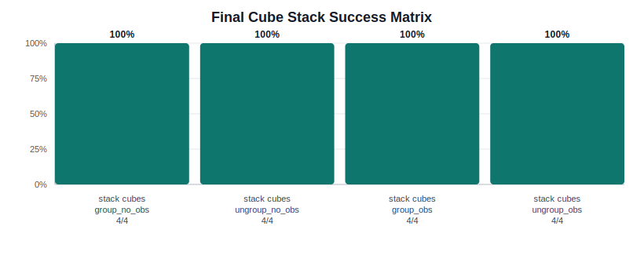
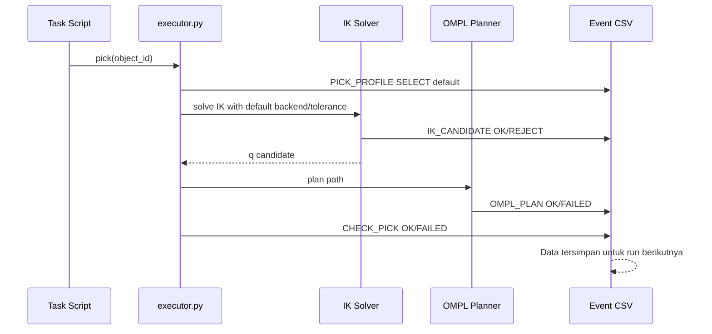
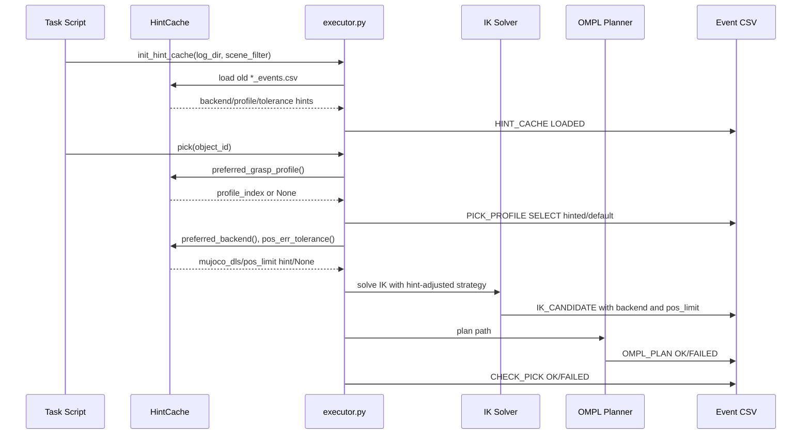

# MVP CTAMP Robot - OMPL Only

Repository ini difokuskan untuk simulasi Franka Panda di MuJoCo dengan IK dan
OMPL joint-space planning. Jalur normal gerak arm adalah:

```text
task script -> scene variant -> IK candidates -> MuJoCo FK validation
            -> joint/state/collision validity -> OMPL plan -> trajectory execution
            -> pick/place feedback -> summary + event logs
```

Direct IK movement tetap bukan jalur utama. IK hanya menghasilkan `goal_q`;
gerak fisik tetap lewat OMPL.

## Status Validasi

Validasi final no-obstacle dari log terbaru:


| Task | Scene | Result | Log summary |
|---|---|---:|---|
| Cubes | `group_no_obs` | 4/4 | `align_cubes_group_no_obs_20260528_225524.csv` |
| Cubes | `ungroup_no_obs` | 4/4 | `align_cubes_ungroup_no_obs_20260528_225522.csv` |
| Tabung | `group_no_obs` | 4/4 | `align_tabung_group_no_obs_20260528_231832.csv` |
| Tabung | `ungroup_no_obs` | 4/4 | `align_tabung_ungroup_no_obs_20260528_232124.csv` |

Validasi final obstacle setelah Refactor 3:


| Task | Scene | Result | Log summary |
|---|---|---:|---|
| Cubes | `group_obs` | 4/4 | `align_cubes_group_obs_20260528_222451.csv` |
| Cubes | `ungroup_obs` | 4/4 | `align_cubes_ungroup_obs_20260528_222638.csv` |
| Tabung | `group_obs` | 4/4 | `align_tabung_group_obs_20260528_231917.csv` |
| Tabung | `ungroup_obs` | 4/4 | `align_tabung_ungroup_obs_20260528_232220.csv` |

Validasi cube stacking setelah penyesuaian top placement:



| Task | Scene | Result | Log summary |
|---|---|---:|---|
| Stack cubes | `group_no_obs` | 4/4 | `stack_cubes_group_no_obs_20260528_224802.csv` |
| Stack cubes | `ungroup_no_obs` | 4/4 | `stack_cubes_ungroup_no_obs_20260528_224800.csv` |
| Stack cubes | `group_obs` | 4/4 | `stack_cubes_group_obs_20260528_224827.csv` |
| Stack cubes | `ungroup_obs` | 4/4 | `stack_cubes_ungroup_obs_20260528_224633.csv` |

## Cara Run

Di WSL Ubuntu 22.04:

```bash
cd /mnt/c/projek/MVP-CTAMP-ROBOT
source .venv/bin/activate
python -m pytest -q
python scripts/align_cubes_ompl_only.py --object group no obs --no-viewer
python scripts/align_cubes_ompl_only.py --object ungroup no obs --no-viewer
python scripts/align_tabung_ompl_only.py --object group no obs --no-viewer
python scripts/align_tabung_ompl_only.py --object ungroup no obs --no-viewer
```

Varian obstacle yang masih didukung:

```bash
python scripts/align_cubes_ompl_only.py --object group obs --no-viewer
python scripts/align_cubes_ompl_only.py --object ungroup obs --no-viewer
python scripts/align_tabung_ompl_only.py --object group obs --no-viewer
python scripts/align_tabung_ompl_only.py --object ungroup obs --no-viewer
```

Varian cube stacking:

```bash
python scripts/stack_cubes_ompl_only.py --object group no obs --no-viewer
python scripts/stack_cubes_ompl_only.py --object ungroup no obs --no-viewer
python scripts/stack_cubes_ompl_only.py --object group obs --no-viewer
python scripts/stack_cubes_ompl_only.py --object ungroup obs --no-viewer
```

Dependency utama:

```bash
pip install -r requirements.txt
python -c "from ompl import base, geometric; print('ompl ok')"
python -c "import pinocchio, robot_descriptions; print('pinocchio ok')"
```

Jika OMPL Python binding tidak tersedia, script OMPL-only berhenti dengan pesan
setup yang eksplisit.

## Progress Refactor


### 1. Refactor 1 - Baseline awal

Fokus awal:

- Menjalankan task OMPL-only untuk cubes/tabung pada scene no-obstacle.
- Mengukur titik awal sebelum perbaikan IK, grasp, dan feedback.
- Membaca kegagalan dari log lama sebagai baseline kuantitatif.

Pipeline saat itu:

```text
task script
  -> target pose statis
  -> IK MuJoCo DLS legacy
  -> satu goal dominan
  -> OMPL plan
  -> execute trajectory
  -> check_pick/check_place
```

Masalah utama dari log:

- `align_cubes_group_no_obs_20260526_232400.csv`: 3/4, `cube4` gagal pick.
- `align_tabung_group_no_obs_20260526_231404.csv`: 2/4, `circle3` dan
  `circle4` gagal pick.
- Banyak kegagalan masih bercampur sebagai `ik_error_above_plan_limit`, padahal
  beberapa sebenarnya collision/state invalid.
- Grasp untuk object jauh atau borderline reach sering terlalu rendah atau
  offset-nya tidak sesuai.
- Log belum cukup eksplisit untuk membedakan:
  - IK numeric error
  - goal collision invalid
  - OMPL no path
  - trajectory execution collision
  - object not lifted

Notes dari capture log:

- No-obstacle failure bukan karena obstacle avoidance.
- Kegagalan cube paling sering muncul di object paling jauh (`cube4`).
- Tabung/cylinder sensitif terhadap radial contact dan residual contact setelah
  place.

### 2. Refactor 2

Fokus utama:

- Membuat backend initialization eksplisit dan event log machine-readable.
- Menambahkan Pinocchio sebagai IK primary dengan MuJoCo FK validation.
- Menambahkan taxonomy failure reason untuk IK, OMPL, collision, dan execution.
- Membuat Pinocchio dan MuJoCo konsisten frame.
- Memastikan valid grasp contact tidak salah dianggap collision.
- Mengurangi retry yang tidak produktif.
- Menstabilkan grasp object jauh/borderline.

Pipeline final:

```text
task script
  -> target pose world MuJoCo
  -> candidate generator
      - nominal target
      - small XY offsets
      - radial/side offsets untuk object jauh/cylinder
      - z variants untuk pregrasp/release
  -> Pinocchio IK in Panda base frame
  -> MuJoCo FK validation in world frame
  -> fallback MuJoCo DLS per candidate jika Pinocchio FK gagal
  -> joint limit validation
  -> planner state validity with ignored target body for grasp/release
  -> ranked valid candidates
  -> OMPL RRTConnect plan
  -> dense trajectory execution with collision checking
  -> pick/place feedback
  -> summary metrics + event logs
```

Perubahan teknis:

- Startup log membedakan `IK_INIT=PINOCCHIO_OK`,
  `IK_INIT=PINOCCHIO_FAILED`, `IK_INIT=MUJOCO_DLS_FALLBACK`,
  `OMPL_INIT=OK`, dan `OMPL_INIT=FAILED`.
- Failure taxonomy membedakan `ik_error_above_limit`,
  `ik_goal_collision_invalid`, `ik_goal_state_invalid`, `ompl_timeout`,
  `ompl_no_path_found`, `execution_failed`, dan `success`.
- Event log ditambah kolom backend, candidate id, seed id, FK error,
  state-validity result, OMPL result, dan execution result.
- Target Pinocchio dikonversi dari MuJoCo world frame ke active arm base frame.
- Setiap hasil Pinocchio tetap divalidasi ulang dengan MuJoCo FK.
- Jika Pinocchio FK gagal threshold segmen, kandidat yang sama dicoba ulang
  dengan MuJoCo DLS.
- `planner.is_state_valid_q()` menerima `ignored_body_names`, sehingga target
  object yang sedang digenggam boleh disentuh pada fase grasp/release.
- Candidate valid per segment dibatasi agar run tidak menghabiskan waktu pada
  kandidat redundant.
- Retry pick dihentikan jika object jatuh di bawah meja atau keluar workspace.
- Ranking grasp cube diberi penalti untuk offset besar, jadi center grasp lebih
  diprioritaskan.
- Grasp object jauh/borderline dinaikkan sedikit untuk menghindari
  `table <-> finger` contact tanpa menonaktifkan collision checking.

Hasil setelah Refactor 2:

- `align_cubes_group_no_obs_20260527_204557.csv`: 4/4.
- `align_cubes_ungroup_no_obs_20260527_205745.csv`: 4/4.
- `align_tabung_group_no_obs_20260527_204857.csv`: 4/4.
- `align_tabung_ungroup_no_obs_20260527_205443.csv`: 4/4.

Notes dari capture log:

- Tahap observability awal sempat memperlihatkan frame mismatch Pinocchio:
  target dikirim dalam frame world MuJoCo, sedangkan model Pinocchio memakai
  frame base Panda. Insight ini digabung ke Refactor 2 karena langsung menjadi
  perbaikan frame conversion.
- OMPL berhasil membuat path untuk goal valid.
- Failure yang tersisa sebelum final mostly bukan OMPL no-path, melainkan grasp
  height/ranking dan target-object collision classification.
- Setelah ignore-list dan far-grasp height fix, `cube4` group no-obs naik dari
  3/4 ke 4/4.

### 3. Refactor 3

Fokus utama:

- Membuat `group_obs` dan `ungroup_obs` cubes/tabung mencapai 4/4 seperti
  no-obstacle.
- Memisahkan objek `NEAR` dari objek `TOO_CLOSE`: `NEAR` dijalankan dengan
  cautious high-clearance, bukan otomatis di-skip.
- Memvalidasi ulang static obstacle mapping agar obstacle mengganggu jalur grab
  di sekitar cluster object, tetapi masih berada di band reachability arm.
- Mengurangi false failure dari kontak ringan `table <-> finger` saat grasp/lift
  tanpa menonaktifkan collision checking.
- Membuat place failure melakukan repick, bukan memanggil `place()` lagi ketika
  tidak ada object yang sedang dipegang.

Pipeline Refactor 3:

```text
task script group_obs / ungroup_obs
  -> validated scene variant
  -> target allocation dengan ceramic buffer lebih besar
  -> precheck:
      TOO_CLOSE -> skip/fail aman
      NEAR      -> cautious execution
      CLEAR     -> normal execution
  -> IK candidates + MuJoCo FK validation
  -> OMPL plan with collision checking
  -> execution with small table-finger tolerance only
  -> pick/place feedback
  -> repick if place slip is recoverable
  -> summary + event logs
```

Perubahan teknis:

- `OBSTACLE_POSITIONS` untuk obstacle scene divalidasi ulang:
  `obstacle1=(0.11, -0.60)` dan `obstacle2=(0.455, 0.27)`.
  Ceramic 1 ditempatkan di sisi depan/negative-y agar tidak satu sisi dengan
  ceramic 2. Ceramic 2 tetap di ujung belakang/positive-y, tetapi digeser
  sedikit mundur. Pada `group_obs`, obstacle membuat `cube2` dan `circle4`
  masuk status `NEAR`. Pada `ungroup_obs`, obstacle membuat `cube4` dan
  `circle4` masuk status `NEAR`, sehingga arm harus memakai cautious
  high-clearance, bukan jalur bebas obstacle.
- `MIN_PICK_OBSTACLE_CLEARANCE` untuk obstacle scene diturunkan ke hard stop
  `0.12 m`, sedangkan `CAUTIOUS_OBSTACLE_CLEARANCE` dinaikkan ke `0.28 m`.
- Target allocation memakai ceramic buffer `0.13 m`, sehingga target tidak
  dipilih terlalu dekat obstacle.
- `TABLE_FINGER_CONTACT_TOLERANCE=0.005` mengizinkan penetrasi finger-table yang
  sangat kecil pada fase grasp/lift, tetapi collision besar tetap gagal.
- Cylinder retry grasp kembali memakai offset minimal `0.095`, karena log
  menunjukkan profile ini yang berhasil mengangkat `circle2`.
- Eksekusi align tabung sekarang mengisi target row dari kanan ke kiri
  berdasarkan X target. Ini mengurangi risiko held cylinder menyapu row yang
  sudah terisi saat membawa tabung ke slot paling kanan.
- Profil grasp cylinder dibuat lebih rendah (`0.095 m`) dengan grip awal tetap
  tidak terlalu ketat (`0.014`), sehingga `circle2` terangkat tanpa membuat
  cylinder borderline seperti `circle4` lepas saat transit.
- Fatal exception seperti obstacle displacement ditangkap di task script agar
  summary CSV tetap tertulis.
- Cube stacking memakai strategi tiga kubus base + satu kubus atas. Target atas
  selalu di-refresh dari pose runtime kubus support, lalu release dibuat lebih
  rendah (`release_lift=0.008`) dan bias X top cube diperkecil (`0.010 m`) agar
  kubus tidak jatuh dari support setelah gripper terbuka.

Hasil Refactor 3:


- Sebelum Refactor 3, `align_cubes_group_obs_20260527_215406.csv`: 1/4.
- Sebelum Refactor 3, `align_tabung_group_obs_20260527_205059.csv`: 1/4.
- Setelah Refactor 3, `align_cubes_group_obs_20260528_222451.csv`: 4/4.
- Setelah Refactor 3, `align_cubes_ungroup_obs_20260528_222638.csv`: 4/4.
- Setelah Refactor 3, `align_tabung_group_obs_20260528_231917.csv`: 4/4.
- Setelah Refactor 3, `align_tabung_ungroup_obs_20260528_232220.csv`: 4/4.
- Cube stacking final:
  `stack_cubes_group_no_obs_20260528_224802.csv`,
  `stack_cubes_ungroup_no_obs_20260528_224800.csv`,
  `stack_cubes_group_obs_20260528_224827.csv`, dan
  `stack_cubes_ungroup_obs_20260528_224633.csv`: semua 4/4.

Notes dari capture log:

- Failure awal bukan karena OMPL tidak bisa plan. OMPL mayoritas solved, tetapi
  object tidak pernah masuk pipeline karena `object_near_obstacle_safety_skip`.
- Pada cubes, obstacle lama terlalu mudah menjadi static mapping problem:
  object bisa slip ke dekat obstacle saat place. Posisi terbaru memindahkan
  ceramic ke dua sisi berbeda sehingga tetap challenging, tetapi tidak
  membuat target valid berubah menjadi `TOO_CLOSE`.
- Pada tabung, retry cylinder terlalu tinggi setelah perubahan sementara,
  sehingga `circle2` tidak terangkat. Mengembalikan retry offset `0.095`
  memulihkan lift.
- Setelah mapping dan execution guard diperbaiki, semua obstacle scene yang
  diuji mencapai 100%. Obstacle tetap cukup dekat untuk memicu
  `CAUTIOUS_OBJECT`, tetapi tidak masuk `TOO_CLOSE`.
- Pada tabung `group_obs` dan `ungroup_obs`, satu object sempat gagal lift pada
  attempt pertama. Retry pick menyelesaikan task, sehingga failure parsial
  tidak berubah menjadi object failure.
- Pada tabung no-obstacle, kegagalan terbaru muncul bukan sebagai OMPL no-path,
  melainkan object lepas saat transit setelah row mulai terisi. Mengisi slot
  kanan terlebih dahulu mengurangi crossing di atas object yang sudah selesai.
- Pada stack cube, dua tower 2-level tidak stabil karena arm masih perlu
  mengambil object berikutnya dan dapat mengganggu tower pertama. Pola tiga
  base + satu top lebih cocok untuk pipeline OMPL saat ini karena support
  target bisa divalidasi ulang setelah base benar-benar settle.

## Insight dari Log

1. No-obstacle failure bukan berarti planner obstacle avoidance buruk.
   Pada run lama, no-obstacle gagal karena IK goal invalid, grasp terlalu rendah,
   atau object tidak terangkat.

2. Label failure harus memisahkan IK numeric dan planner validity.
   Goal dengan FK bagus tetapi collision invalid tidak boleh disebut
   `ik_error_above_limit`.

3. Pinocchio harus selalu divalidasi dengan MuJoCo FK.
   Pinocchio dan MuJoCo dapat memakai frame/model offset berbeda. FK validation
   adalah guard utama sebelum goal masuk OMPL.

4. Grasp target tidak sama dengan transit target.
   Pada grasp/release, target object memang boleh disentuh. State-validity check
   harus memakai ignore-list yang sama dengan OMPL.

5. Object jauh seperti `cube4` perlu treatment khusus.
   Di workspace borderline, sedikit kenaikan grasp height lebih benar daripada
   melonggarkan collision checker.

6. Retry harus berhenti jika object sudah tidak valid.
   Jika object jatuh di bawah meja atau keluar reach, retry IK/OMPL hanya
   membuang waktu dan memperkeruh log.

7. Obstacle placement harus divalidasi sebagai bagian dari task generation.
   Jika obstacle berada tepat di koridor pick-place, failure terlihat seperti
   grasp/place issue padahal akar masalahnya static mapping.

## Log dan Metrik

Setiap run menghasilkan:

- summary CSV: `logs/<task>_<scene>_<timestamp>.csv`
- event CSV: `logs/<task>_<scene>_<timestamp>_events.csv`

Kolom penting untuk tracing:

- `stage`, `status`, `phase`, `failure_reason`
- `object_id`, `held_object`, `object_xyz`, `object_z`
- `target_xyz`, `actual_xyz`, `distance_to_target`
- `ee_xyz`, `q`, `q_target`, `q_error_norm`, `finger_pos`
- `backend`, `candidate_id`, `seed_id`
- `planner`, `waypoints`, `pos_err`, `ori_err`, `iterations`
- `joint_limit_valid`, `state_valid`, `state_invalid_reason`
- `ompl_result`, `execution_result`
- `collision_pair`, `contact_count`, `penetration`

Urutan baca praktis:

```text
1. Cari status=FAILED.
2. Baca stage + phase.
3. Baca failure_reason.
4. Jika IK_CANDIDATE, cek pos_err/ori_err/state_valid.
5. Jika OMPL_PLAN, cek ompl_result dan goal_attempts di extra_json.
6. Jika TRAJECTORY_EXEC, cek collision_pair dan waypoint.
7. Cocokkan dengan CHECK_PICK/CHECK_PLACE untuk outcome object.
```

Data visualisasi dibuat dari log dan disimpan di:

- `docs/refactor_success_progress.svg`
- `docs/final_no_obs_success_matrix.svg`
- `docs/final_obs_success_matrix.svg`
- `docs/final_stack_success_matrix.svg`
- `docs/refactor3_group_obs_progress.svg`
- `docs/failure_focus_by_refactor.svg`
- `docs/refactor_metrics.csv`

Notebook analisis lengkap tersedia di:

- `docs/ompl_log_analysis.ipynb`

Notebook tersebut membuat dataframe terukur:

- `summary_df`: ringkasan log kurasi yang masih dipakai.
- `metrics_df`: metrik refactor dari `docs/refactor_metrics.csv`.
- `progress_df`: progress Refactor 1, 2, dan 3.
- `final_df`: matrix validasi final 8 command utama.
- `failure_reason_df`: failure reason yang menjadi dasar perubahan.
- `events_df`: event log untuk tracing IK/OMPL/execution.

Output dataframe ringkas dari notebook disimpan di `docs/notebook_outputs/`.
Gambar utama untuk README disimpan sebagai SVG di `docs/` agar tidak ada PNG/CSV
besar yang redundant.

## Konfigurasi Penting

Default ada di `.env.example`:

```env
IK_BACKEND=auto
IK_REQUIRE_PINOCCHIO=false
IK_PLAN_POS_ERR_LIMIT=0.020
IK_PREGRASP_POS_ERR_LIMIT=0.030
IK_PLAN_ORI_ERR_LIMIT=0.35
IK_PREGRASP_ORI_ERR_LIMIT=0.50
MAX_VALID_IK_CANDIDATES=6
MAX_IK_ATTEMPTS_PER_SEGMENT=80
OMPL_ENABLED=true
OMPL_REQUIRED=false
OMPL_PLANNER_NAME=RRTConnect
OMPL_TIME_LIMIT=6.0
USE_IK_FALLBACK=false
MIN_PICK_OBSTACLE_CLEARANCE=0.18
CAUTIOUS_OBSTACLE_CLEARANCE=0.24
TABLE_FINGER_CONTACT_TOLERANCE=0.005
CYLINDER_RETRY_MIN_GRASP_OFFSET=0.095
CYLINDER_TIPPED_CENTER_Z=0.832
CYLINDER_TIPPED_GRASP_OFFSET=0.075
CYLINDER_TIPPED_GRIP=0.010
```

Untuk production-style run, `USE_IK_FALLBACK=false` harus tetap dipertahankan
agar arm tidak bypass OMPL.

Untuk obstacle scene, task script menerapkan override aman:
`MIN_PICK_OBSTACLE_CLEARANCE=0.12`, `CAUTIOUS_OBSTACLE_CLEARANCE=0.28`,
`MAX_VALID_IK_CANDIDATES=8`, dan `OMPL_TIME_LIMIT=8.0`.

## Test

```bash
python -m pytest -q
```

Hasil terakhir di WSL Ubuntu 22.04 `.venv`: `13 passed`.

Skip di Windows terjadi karena OMPL/Pinocchio tidak tersedia di interpreter
aktif Windows, sedangkan WSL `.venv` sudah lengkap.

## HintCache — Adaptive Heuristic Learning

Setelah Refactor 3, sistem ditambahkan modul pembelajaran adaptif bernama
**HintCache** (`src/hint_cache.py`). Modul ini membaca event log dari run
sebelumnya dan menghasilkan hint yang digunakan langsung pada run berikutnya,
tanpa model ML eksternal.

### Cara Kerja

Saat startup, `init_hint_cache(log_dir, scene_filter)` membaca semua file
`*_events.csv` yang cocok dengan scene aktif. Data dibagi ke dalam
**workspace bucket**:

- **Reach bucket**: `near` (<0.5 m), `mid` (0.5–0.7 m), `far` (0.7–0.85 m), `borderline` (>0.85 m)
- **Obstacle bucket**: `clear` (>0.28 m), `near` (0.12–0.28 m), `too_close` (<0.12 m)

Dari data tersebut, HintCache menghasilkan tiga hint:

| Hint | Fungsi |
|---|---|
| `preferred_backend()` | Skip Pinocchio untuk seluruh run jika tingkat FK-validation-failure ≥ 70% |
| `pos_err_tolerance()` | Lebarkan batas penerimaan IK per bucket jika banyak kandidat "near miss" |
| `preferred_grasp_profile()` | Pilih profil grasp dengan success rate tertinggi per `(obj_class, reach_bucket)` |

Hint hanya aktif setelah minimal **5 data point** per bucket terkumpul
(`MIN_SAMPLES`). Saat data belum cukup, sistem menggunakan default — jadi
run pertama tetap aman.

### Dampak Terukur

Pada scene `separate_groups_ungroup_obs`, Pinocchio FK validation gagal di
68% dari semua IK attempt (631/929). Ini menyebabkan runtime 22.5 menit di
run pertama. Dari run kedua, HintCache mendeteksi pola ini dan skip
Pinocchio secara otomatis, memotong runtime menjadi ±8 menit.

### Penggunaan

```bash
# HintCache aktif (default)
python scripts/separate_groups_ompl_only.py --object ungroup obs --no-viewer

# HintCache dinonaktifkan (untuk baseline / perbandingan)
python scripts/separate_groups_ompl_only.py --object ungroup obs --no-viewer --no-hint-cache
```

Flag `--no-hint-cache` tersedia di semua task script.

Untuk melihat apa yang dipelajari HintCache pada suatu run:

```bash
grep "HINT_CACHE" logs/<run>_events.csv
```

### Parameter yang Bisa Di-tune

| Env var | Default | Fungsi |
|---|---|---|
| `HINT_MIN_SAMPLES` | 5 | Minimum data per bucket sebelum hint aktif |
| `HINT_PINOCCHIO_SKIP_RATE` | 0.70 | Threshold failure rate untuk skip Pinocchio |
| `HINT_NEAR_MISS_RATE` | 0.40 | Fraksi near-miss untuk trigger toleransi lebih lebar |
| `HINT_MAX_TOLERANCE_FACTOR` | 1.60 | Batas maksimum pelebaran toleransi IK |

### Visualisasi Sequence Diagram

Sebelum HintCache:



Sesudah HintCache:



### Cara Membaca Bedanya di Log

Checklist sebelum HintCache:

- Cari apakah ada `HINT_CACHE LOADED`.
  - Jika tidak ada dan script memakai `--no-hint-cache`, berarti HintCache disabled.
- Lihat `PICK_PROFILE SELECT`.
  - Jika `profile_index` mengikuti attempt default, belum ada profile hint yang berpengaruh.
- Lihat `IK_CANDIDATE`.
  - `pos_limit` biasanya default dari config.
  - `backend` mengikuti backend default, sering `pinocchio` jika tersedia.
- Lihat `IK_SOLVE BACKEND_FALLBACK`.
  - Jika banyak, ini menjadi bahan HintCache untuk run berikutnya.

Checklist sesudah HintCache:

- Harus ada `HINT_CACHE LOADED`.
  - Di extra data, cek `logs_loaded`, `rows_loaded`, `pinocchio_skip`, `pos_err_hints`, dan `profile_hints`.
- Bandingkan `PICK_PROFILE SELECT`.
  - Jika `profile_index` langsung berubah pada attempt pertama, berarti `preferred_grasp_profile()` bekerja.
- Bandingkan `IK_CANDIDATE`.
  - Jika `backend=mujoco_dls` padahal default backend Pinocchio, berarti `preferred_backend()` bekerja.
  - Jika `pos_limit` lebih besar dari default, berarti `pos_err_tolerance()` bekerja.
- Bandingkan hasil.
  - Sukses yang diharapkan: lebih sedikit `IK_SOLVE BACKEND_FALLBACK`, lebih sedikit `CHECK_PICK FAILED`, dan object lebih cepat masuk `CHECK_PICK OK`.


| Bagian Log | Sebelum HintCache | Sesudah HintCache |
|---|---|---|
| `HINT_CACHE` | Tidak ada, disabled, atau cold-start tanpa hint berarti | Ada `HINT_CACHE LOADED` dengan summary |
| `PICK_PROFILE SELECT` | Profile default berdasarkan attempt | Bisa langsung memakai profile yang pernah sukses |
| `IK_CANDIDATE backend` | Mengikuti backend default | Bisa langsung `mujoco_dls` jika Pinocchio sering fallback |
| `IK_CANDIDATE pos_limit` | Default config | Bisa widened jika banyak near-miss IK |
| `IK_SOLVE BACKEND_FALLBACK` | Bisa sering muncul | Harus berkurang jika backend hint efektif |
| `CHECK_PICK` | Bisa gagal lalu retry profile berikutnya | Harapannya lebih cepat `OK` karena profile awal lebih cocok |
| Validasi akhir | Tetap sama | Tetap sama, HintCache tidak melonggarkan success condition |


## Visualisasi Data Performance HintCache


