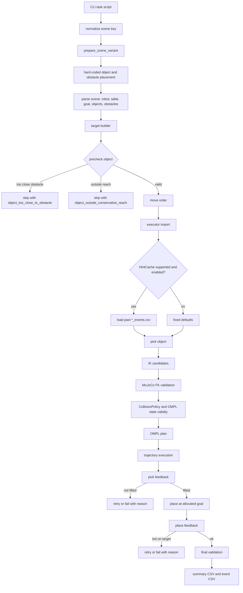
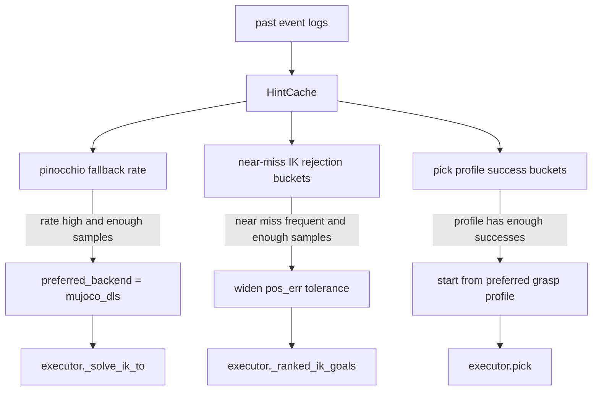
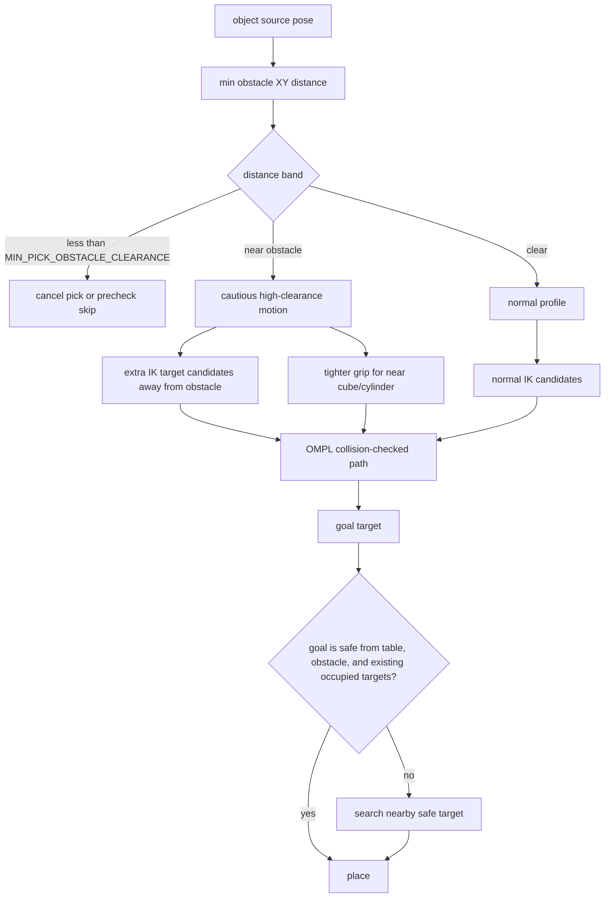
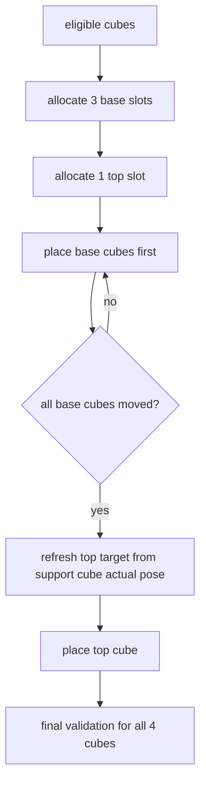

# End-to-End CTAMP Pipeline: Obstacle, Goal, and Log POV

Dokumen ini merangkum alur runtime task OMPL-only setelah pull terbaru,
termasuk HintCache, obstacle handling, goal allocation, dan alasan yang
terlihat dari event log.

## Script Coverage

| Script | Object classes | Scene conditions | HintCache |
|---|---|---|---|
| `scripts/align_cubes_ompl_only.py` | cube | group/ungroup, obs/no_obs | yes, default on |
| `scripts/align_tabung_ompl_only.py` | circle/cylinder | group/ungroup, obs/no_obs | yes, default on |
| `scripts/separate_groups_ompl_only.py` | cube + circle | group/ungroup, obs/no_obs | yes, default on |
| `scripts/stack_cubes_ompl_only.py` | cube | group/ungroup, obs/no_obs | no |

HintCache can be disabled in supported scripts with `--no-hint-cache`.
Stacking does not currently call `executor.init_hint_cache()`.

## End-to-End Pipeline



## HintCache Decision Flow



Cold start is safe: if there are not enough samples, HintCache returns `None`
and executor uses fixed defaults.

## Obstacle and Goal Handling



Object and goal positions are deterministic, not random. Scene variants are
generated from hard-coded placements in `ctamp_task_utils.py`, then target
builders compute deterministic goal slots from the goal area plus safety search.

## Stack-Specific Flow



The important refactor is that the top cube waits for all base cubes, not only
its direct support. This prevents a later base retry from knocking down the top
cube after it was already placed.

## Event Log POV

| Log stage | What the robot is doing | Typical reason field |
|---|---|---|
| `TASK_CONTEXT` | Records scene, move order, targets, skipped precheck | none |
| `OBSTACLE_PROXIMITY` | Marks object as near obstacle or blocked | `object_too_close_to_obstacle` |
| `HINT_CACHE` | Loads learned hints from previous logs | `LOADED`, `FAILED` |
| `PICK_PROFILE` | Chooses grip, grasp offset, clearance profile | profile metadata |
| `PICK_PRECHECK` | Reads object pose and obstacle distance before motion | pose or clearance data |
| `IK_CANDIDATE` | Tests candidate pose/joint solution | `ik_error_above_limit`, `ik_goal_collision_invalid` |
| `IK_SOLVE` | Selects IK backend or falls back | `pinocchio_fk_validation_failed` |
| `OMPL_PLAN` | Plans collision-checked joint path | `ompl_failed_no_fallback` |
| `TRAJECTORY_EXEC` | Executes path and watches contacts | `collision_at_waypoint_*` |
| `OBSTACLE_MONITOR` | Fails fast if obstacle is displaced | `obstacle_displaced` |
| `CHECK_PICK` | Verifies object was lifted | `object_not_lifted_after_pick` |
| `CHECK_PLACE` | Verifies object reached target row | `object_not_on_target_after_place` |
| `CHECK_STACK_PLACE` | Verifies stack placement and height | `object_not_on_stack_target` |
| final validation | Ensures final state remains valid | `object_moved_after_stack` |

## Current Verification

Latest local verification after pull:

```text
pytest -q
13 passed
```

Runtime validations from the latest completed logs before this document:

| Task | Scene | Result |
|---|---|---|
| align cubes | group_obs | 4/4 |
| align cubes | ungroup_obs | 4/4 |
| align tabung | group_obs | 4/4 |
| align tabung | ungroup_obs | 4/4 |
| stack cubes | group_no_obs | 4/4 |
| stack cubes | ungroup_no_obs | 4/4 |
| stack cubes | group_obs | 4/4 |
| stack cubes | ungroup_obs | 4/4 |

