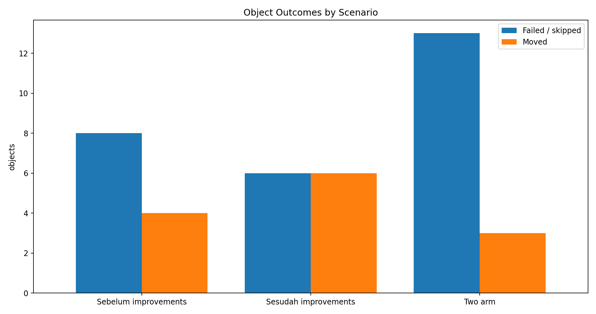
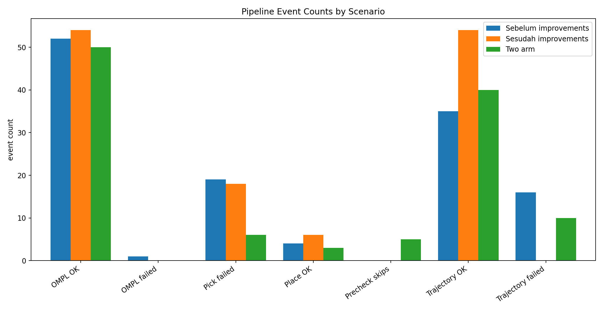
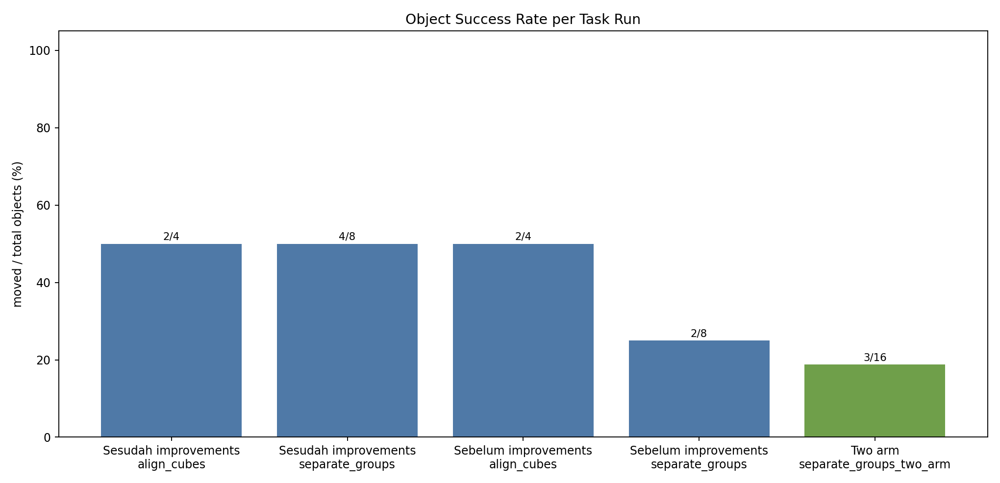
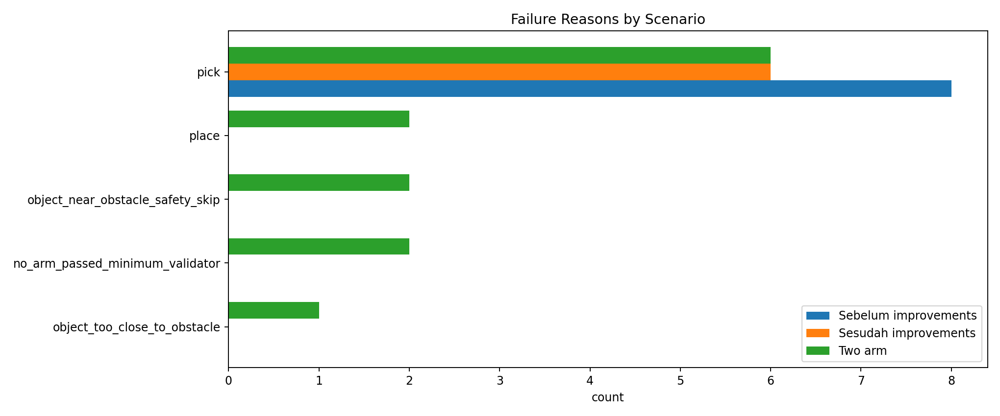
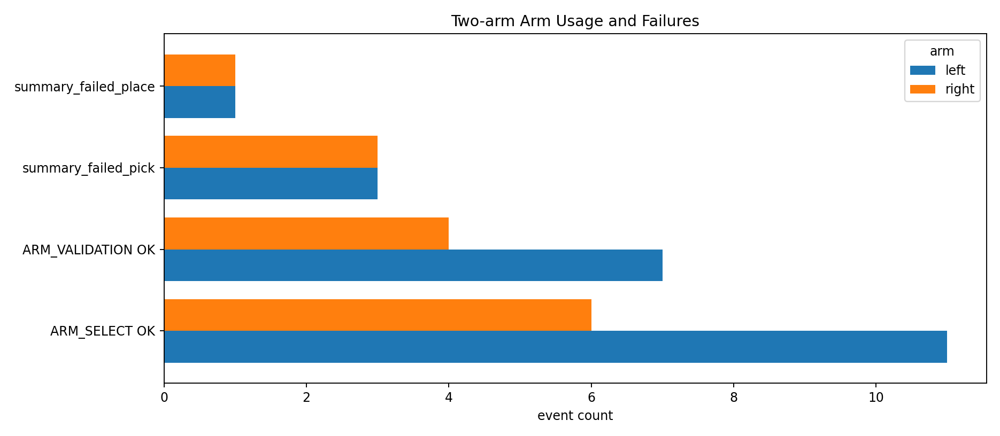

# Improvement Log Comparison

Perbandingan ini memakai log yang tersedia di `logs/` dan membagi run menjadi tiga skenario:

- **Sebelum improvements**: run awal `align_cubes` dan `separate_groups`.
- **Sesudah improvements**: run single-arm setelah perubahan precheck/recovery/IK.
- **Two arm**: run `separate_groups_two_arm`.

## Scenario Metrics

| scenario_label | runs | objects_moved | objects_total | failed_count | success_rate_objects | ompl_start | ompl_ok | ompl_failed | trajectory_ok | trajectory_failed | pick_failed | place_ok_events | collision_blocked | precheck_skips |
| --- | --- | --- | --- | --- | --- | --- | --- | --- | --- | --- | --- | --- | --- | --- |
| Sebelum improvements | 2 | 4 | 12 | 8 | 33.30 | 53 | 52 | 1 | 35 | 16 | 19 | 4 | 16 | 0 |
| Sesudah improvements | 2 | 6 | 12 | 6 | 50 | 54 | 54 | 0 | 54 | 0 | 18 | 6 | 0 | 0 |
| Two arm | 2 | 3 | 16 | 13 | 18.80 | 50 | 50 | 0 | 40 | 10 | 6 | 3 | 10 | 5 |

`success_rate_objects` dalam persen.

## Task Metrics

| scenario_label | task | objects_moved | objects_total | failed_count | success_rate_objects | duration_ms |
| --- | --- | --- | --- | --- | --- | --- |
| Sesudah improvements | align_cubes | 2 | 4 | 2 | 50 | 63210 |
| Sesudah improvements | separate_groups | 4 | 8 | 4 | 50 | 130285 |
| Sebelum improvements | align_cubes | 2 | 4 | 2 | 50 | 38746 |
| Sebelum improvements | separate_groups | 2 | 8 | 6 | 25 | 92245 |
| Two arm | separate_groups_two_arm | 3 | 16 | 13 | 18.80 | 222776 |

## Summary Failure Counts

| scenario_label | task | stage | failure_reason | arm | count |
| --- | --- | --- | --- | --- | --- |
| Sebelum improvements | separate_groups | pick | pick |  | 6 |
| Sebelum improvements | align_cubes | pick | pick |  | 2 |
| Sesudah improvements | separate_groups | pick | pick |  | 4 |
| Sesudah improvements | align_cubes | pick | pick |  | 2 |
| Two arm | separate_groups_two_arm | pick | pick | left | 3 |
| Two arm | separate_groups_two_arm | pick | pick | right | 3 |
| Two arm | separate_groups_two_arm | precheck | no_arm_passed_minimum_validator |  | 2 |
| Two arm | separate_groups_two_arm | precheck | object_near_obstacle_safety_skip |  | 2 |
| Two arm | separate_groups_two_arm | place | place | left | 1 |
| Two arm | separate_groups_two_arm | place | place | right | 1 |
| Two arm | separate_groups_two_arm | precheck | object_too_close_to_obstacle |  | 1 |

## Event Failure Hotspots

| scenario_label | stage | failure_label | count |
| --- | --- | --- | --- |
| Sebelum improvements | IK_ELBOW_UP | IK_ELBOW_UP | 38 |
| Sebelum improvements | COLLISION_CHECK | robot-env contact: table/1 <-> left_finger/82 | 16 |
| Sebelum improvements | TRAJECTORY_EXEC | collision_at_waypoint_0 | 16 |
| Sebelum improvements | PICK | move_pregrasp_failed \| pregrasp | 15 |
| Sebelum improvements | MOVE_POSE | ompl_failed_no_fallback \| pick(circle1) pregrasp | 3 |
| Sebelum improvements | MOVE_POSE | ompl_failed_no_fallback \| pick(circle2) pregrasp | 3 |
| Sebelum improvements | MOVE_POSE | ompl_failed_no_fallback \| pick(circle3) pregrasp | 3 |
| Sebelum improvements | MOVE_POSE | ompl_failed_no_fallback \| pick(circle4) pregrasp | 3 |
| Sesudah improvements | IK_SOLVE | ik_error_above_plan_limit | 18 |
| Sesudah improvements | PICK | move_pregrasp_failed \| pregrasp | 18 |
| Two arm | PICK | move_grasp_failed \| grasp | 6 |
| Two arm | TRAJECTORY_EXEC | collision_at_waypoint_1 | 5 |
| Two arm | COLLISION_CHECK | robot-env contact: table/1 <-> right_left_finger/161 | 4 |
| Two arm | TRAJECTORY_EXEC | collision_during_final_settle | 4 |
| Two arm | IK_SOLVE | ik_error_above_plan_limit | 3 |
| Two arm | COLLISION_CHECK | robot-env contact: table/1 <-> left_finger/80 | 2 |
| Two arm | COLLISION_CHECK | robot-env contact: table/1 <-> left_finger/82 | 2 |
| Two arm | COLLISION_CHECK | robot-env contact: table/1 <-> right_left_finger/163 | 2 |

## Visualizations

## Sintesa

1. **Sebelum improvements**, planner sering berhasil, tetapi eksekusi trajectory masih rapuh. Banyak kegagalan terjadi setelah `OMPL_PLAN OK`, terutama saat live trajectory validation dan pick pregrasp/grasp.
2. **Sesudah improvements single-arm**, kandidat berisiko mulai disaring lewat precheck. Ini menurunkan percobaan pada object dekat obstacle, tetapi metrik sukses object masih dibatasi oleh reachable workspace dan kualitas pick/place.
3. **Two arm** menambah fallback sisi: validator memilih arm dengan reach pick/place terbaik dan dapat switch jika pick di sisi pertama gagal. Pada log yang ada, two-arm membantu memindahkan sebagian pekerjaan ke arm kanan untuk object atas, tetapi run masih belum sukses penuh karena kegagalan pick/place fisik masih muncul setelah validasi reach lulus.
4. Bottleneck terbaru bukan sekadar OMPL menemukan path. Bottleneck bergeser ke kualitas grasp/lift dan akurasi place, sehingga next improvement paling berdampak adalah per-arm grasp candidate sampling, validasi IK pose grasp sebelum OMPL, dan strategi release/place yang lebih stabil.
