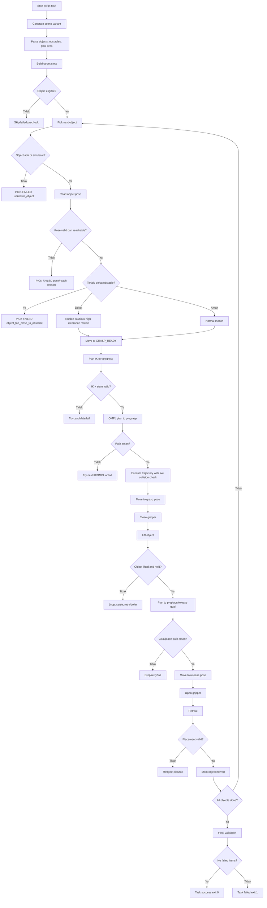
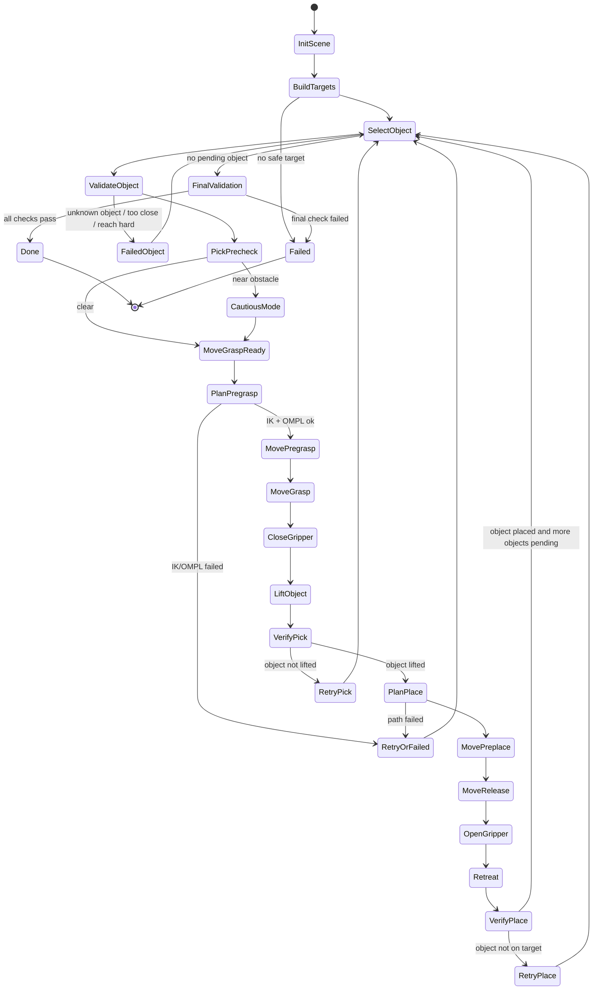
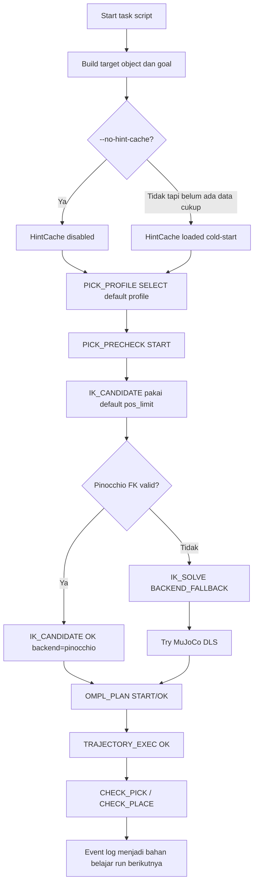
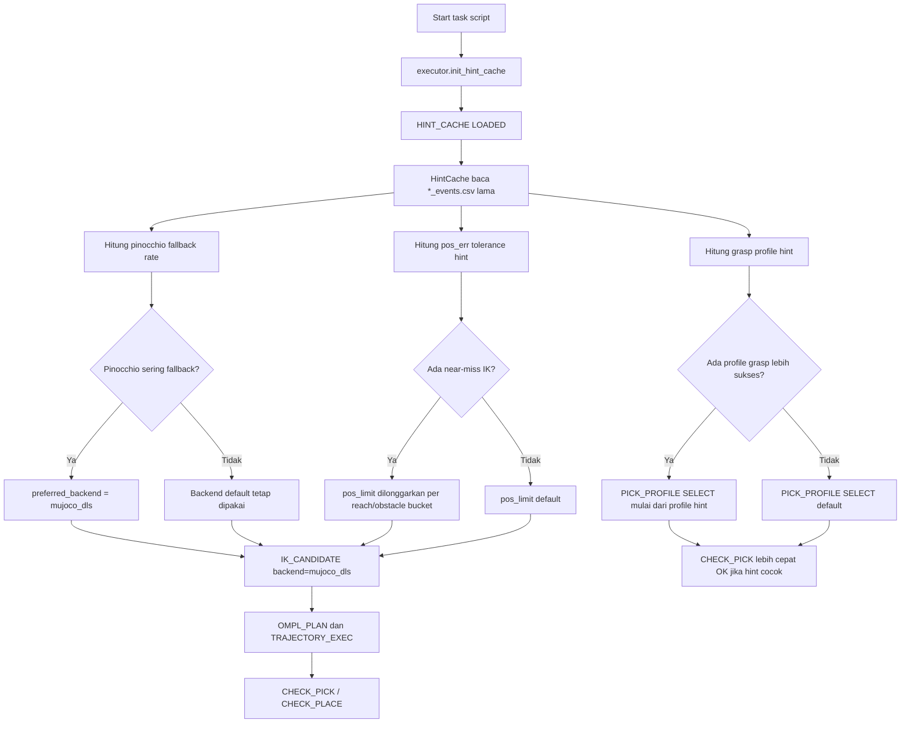
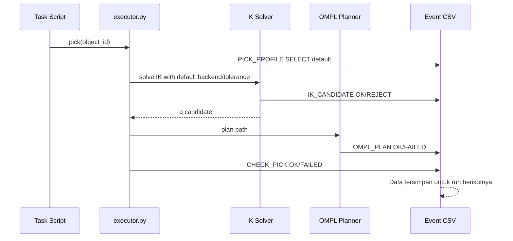
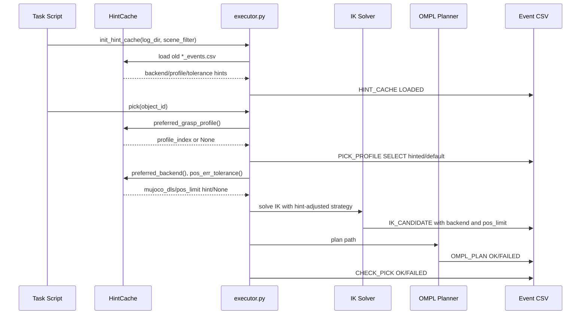
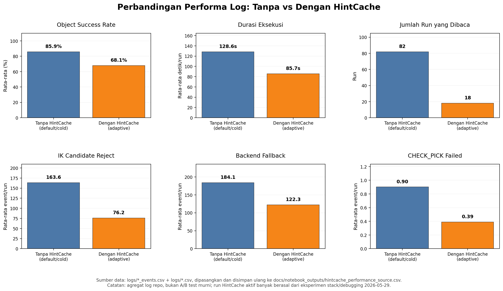

# Analisis Step by Step Robot Arm Pick and Place

Dokumen ini menganalisis alur robot arm pada kode di repo ini. Karena prompt tidak menempelkan satu file kode spesifik pada bagian `# PASTE KODE DI SINI`, analisis ini memakai kode yang benar-benar menjadi pipeline aplikasi:

- `scripts/align_cubes_ompl_only.py`: task align kubus.
- `scripts/align_tabung_ompl_only.py`: task align tabung/silinder.
- `scripts/stack_cubes_ompl_only.py`: task stack 4 kubus.
- `src/executor.py`: eksekutor gerak robot, IK, OMPL, pick, place.
- `src/feedback.py`: validasi pick/place setelah aksi.
- `src/collision_policy.py`: safety policy collision.
- `src/hint_cache.py`: adaptive hint dari log sebelumnya.
- `scripts/ctamp_task_utils.py`: scene variant, object placement, obstacle placement, goal area.

## 1. Ringkasan Fungsi Kode

Kode ini digunakan untuk mengatur robot arm dalam proses pick and place di simulator MuJoCo: memilih object dari scene, mengecek reachability dan obstacle, merencanakan gerak dengan IK + OMPL, mengambil object, membawa object ke target/goal, meletakkan object, lalu memvalidasi apakah task sukses.

Untuk task align, object disusun ke baris target di goal area. Untuk task stack, cube wajib membentuk satu tower 4 layer: `cube1` di bawah, `cube2` di atas `cube1`, `cube3` di atas `cube2`, dan `cube4` di atas `cube3`.

## 2. Komponen Penting dalam Kode

| Komponen Kode | Fungsi | Bukti Kode |
|---|---|---|
| `prepare_scene_variant()` | Membuat scene sesuai kondisi `group_no_obs`, `ungroup_no_obs`, `group_obs`, `ungroup_obs`; memasukkan object, obstacle, dan goal area ke XML hasil generate. | `scripts/ctamp_task_utils.py:153`<br><br>```python\ndef prepare_scene_variant(raw: str | Iterable[str] | None) -> Path:\n    scene_key = normalize_scene_key(raw)\n    _validate_variant(scene_key)\n    ...\n    inserts = [_goal_area_body()]\n    for object_name, pos in VARIANT_OBJECTS[scene_key].items():\n        inserts.append(_movable_body(object_name, pos))\n    if scene_key in {\"group_obs\", \"ungroup_obs\"}:\n        for obstacle_name, pos in OBSTACLE_POSITIONS.items():\n            inserts.append(_obstacle_body(obstacle_name, pos))\n``` |
| `_build_aligned_cube_targets()` | Memilih cube yang eligible, mengecek obstacle/reach, lalu membuat target posisi sejajar untuk cube. | `scripts/align_cubes_ompl_only.py:303`<br><br>```python\ndef _build_aligned_cube_targets(scene_file: str, spacing: float = 0.11):\n    world_state = _parse_scene(scene_file)\n    cubes = [obj for obj in world_state[\"movable_objects\"] if obj.get(\"class\") == \"cube\"]\n    ...\n    target_xy = _search_safe_target_xy(base_x, row_y, radius, world_state, occupied)\n``` |
| `_build_aligned_cylinder_targets()` | Memilih tabung/silinder eligible, mengecek obstacle/reach, lalu membuat target posisi sejajar untuk tabung. | `scripts/align_tabung_ompl_only.py:43`<br><br>```python\ndef _build_aligned_cylinder_targets(scene_file: str, spacing: float = 0.105):\n    world_state = _parse_scene(scene_file)\n    cylinders = [\n        obj for obj in world_state[\"movable_objects\"]\n        if obj.get(\"class\") in {\"circle\", \"cylinder\"} or obj[\"id\"].lower().startswith(\"circle\")\n    ]\n``` |
| `_build_cube_stack_targets()` | Membuat target tower 4 layer, bukan sekadar menaruh sebagian cube. | `scripts/stack_cubes_ompl_only.py:51`<br><br>```python\ndef _build_cube_stack_targets(scene_file: str):\n    \"\"\"Build one four-layer cube tower: cube1 <- cube2 <- cube3 <- cube4.\"\"\"\n    ...\n    required_order = [\"cube1\", \"cube2\", \"cube3\", \"cube4\"]\n    ...\n    \"support_object_id\": required_order[level - 1] if level > 0 else None,\n``` |
| `_target_xy_ok()` | Mengecek target masih di atas meja, reachable, aman dari obstacle ceramic, dan tidak overlap dengan object lain. | `scripts/align_cubes_ompl_only.py:116`<br><br>```python\ndef _target_xy_ok(x: float, y: float, radius: float, world_state, occupied=()) -> bool:\n    table = world_state[\"table\"]\n    if not (table[\"x_range\"][0] < x < table[\"x_range\"][1] and table[\"y_range\"][0] < y < table[\"y_range\"][1]):\n        return False\n    if not _reachable(x, y, world_state):\n        return False\n    if not _clear_from_ceramic(x, y, radius, world_state):\n        return False\n``` |
| `_search_safe_target_xy()` | Jika target awal kurang aman, sistem mencari target alternatif dekat posisi awal. | `scripts/align_cubes_ompl_only.py:130`<br><br>```python\ndef _search_safe_target_xy(base_x: float, base_y: float, radius: float, world_state, occupied=(), y_min=None, y_max=None):\n    ...\n    for x, y in unique:\n        ...\n        if _target_xy_ok(x, y, radius, world_state, occupied):\n            return x, y\n    return None\n``` |
| `executor.pick()` | High-level action untuk mengambil object: validasi object, precheck, gerak pregrasp, gerak grasp, tutup gripper, lift, validasi object terangkat. | `src/executor.py:1496`<br><br>```python\ndef pick(obj):\n    _log_arm_state(\"PICK\", \"START\", object_id=obj)\n    if obj not in name_to_cube:\n        _log_arm_state(\"PICK\", \"FAILED\", object_id=obj, failure_reason=\"unknown_object\")\n        return\n``` |
| `executor.place()` | High-level action untuk meletakkan object: validasi sedang memegang object, precheck goal, preplace, release, open gripper, retreat, log OK. | `src/executor.py:1766`<br><br>```python\ndef place(x, y, obj=None, target_z: float = 0.83, release_lift: float = 0.06, ...):\n    _log_arm_state(\"PLACE\", \"START\", object_id=obj or _held_object_name, target_xyz=[...])\n    if _held_object_name is None:\n        _log_arm_state(\"PLACE\", \"FAILED\", object_id=obj, failure_reason=\"no_object_held\")\n        return\n``` |
| `_move_pose_safe()` | Mengubah target XYZ menjadi kandidat IK, memilih IK valid, lalu meminta OMPL merencanakan dan mengeksekusi path aman. | `src/executor.py:1266`<br><br>```python\ndef _move_pose_safe(target_xyz, grip, null_ref=None, ignored_body_names=None, label=\"\", cautious_motion=False) -> bool:\n    ranked_attempts = _ranked_ik_goals(target_xyz, null_ref, label, ignored_body_names=ignored_body_names)\n    valid_attempts = [item for item in ranked_attempts if item.failure_reason == IK_SUCCESS]\n``` |
| `_ranked_ik_goals()` | Membuat banyak kandidat IK, mengecek FK, joint limit, dan validitas state planner. | `src/executor.py:913`<br><br>```python\njoint_ok = joint_limits_valid(q, arm_ranges[:, 0], arm_ranges[:, 1])\nstate_valid = planner.is_state_valid_q(q, ignored_body_names=ignored_body_names)\nreason = classify_ik_attempt(...)\n``` |
| `_move_with_ompl()` | Merencanakan path dengan OMPL. Jika gagal, mencoba planner lain; jika sukses, mengeksekusi trajectory. | `src/executor.py:1127`<br><br>```python\nfor attempt_index, attempt_planner in enumerate(planner_attempts, start=1):\n    traj, info = planner.plan(...)\n    if traj is None:\n        _log_arm_state(\"OMPL_PLAN_ATTEMPT\", \"FAILED\", ...)\n        continue\n    _log_arm_state(\"OMPL_PLAN\", \"OK\", ...)\n``` |
| `_execute_joint_trajectory()` | Mengeksekusi waypoint satu per satu dan mengecek collision selama gerak. | `src/executor.py:1040`<br><br>```python\nfor waypoint_index, q in enumerate(traj):\n    ...\n    if not _check_live_collision(context=f\"trajectory waypoint {waypoint_index}\", ignored_body_names=ignored_body_names):\n        _log_arm_state(\"TRAJECTORY_EXEC\", \"FAILED\", failure_reason=f\"collision_at_waypoint_{waypoint_index}\")\n        return False\n``` |
| `CollisionPolicy.check_contacts()` | Menentukan contact mana yang dianggap aman/tidak aman. Contact robot dengan object lain, obstacle, dan table divalidasi dengan toleransi. | `src/collision_policy.py:112`<br><br>```python\nif (geom1_robot and geom2_env) or (geom2_robot and geom1_env):\n    ...\n    if env_body in self.ignored_body_names:\n        continue\n    ...\n    if env_body is not None and self._is_obstacle(env_body):\n        if penetration <= self.obstacle_penetration_tolerance:\n            continue\n    return CollisionReport(valid=False, ...)\n``` |
| `feedback.check_pick()` | Mengecek object benar-benar terangkat setelah pick. | `src/feedback.py:18`<br><br>```python\ndef check_pick(model, data, cube_id):\n    mujoco.mj_forward(model, data)\n    z = float(data.xpos[cube_id][2])\n    return z > HELD_Z_THRESHOLD, round(z, 3)\n``` |
| `feedback.check_place()` | Mengecek object sudah dekat target dan berada di ketinggian table. | `src/feedback.py:54`<br><br>```python\ndef check_place(model, data, cube_id, target_x, target_y):\n    ...\n    on_table  = float(pos[2]) < PLACED_Z_THRESHOLD\n    near_goal = float(np.linalg.norm(pos[:2] - np.array([target_x, target_y]))) < PLACE_TOLERANCE_M\n    return on_table and near_goal, actual\n``` |
| `HintCache` | Membaca log sebelumnya untuk memberi hint backend IK, toleransi posisi, dan profil grasp. | `src/hint_cache.py:78`<br><br>```python\nclass HintCache:\n    \"\"\"\n    Reads past *_events.csv logs and surfaces three adaptive hints:\n      preferred_backend()\n      pos_err_tolerance()\n      preferred_grasp_profile()\n    \"\"\"\n``` |

## 3. Alur Step by Step Robot Arm

### Step 1: Robot Menentukan Object Target

Object tidak berasal dari kamera. Object berasal dari scene XML yang digenerate oleh `prepare_scene_variant()`, lalu diparse sebagai `world_state["movable_objects"]`. Untuk cube, target dipilih dari object dengan class `cube`; untuk tabung, dari class `circle`/`cylinder`; untuk stack, urutannya fixed: `cube1`, `cube2`, `cube3`, `cube4`.

Bukti kode:

```python
# scripts/align_cubes_ompl_only.py:303
cubes = [
    obj for obj in world_state["movable_objects"]
    if obj.get("class") == "cube"
]

# scripts/align_tabung_ompl_only.py:45
cylinders = [
    obj for obj in world_state["movable_objects"]
    if obj.get("class") in {"circle", "cylinder"} or obj["id"].lower().startswith("circle")
]

# scripts/stack_cubes_ompl_only.py:88
required_order = ["cube1", "cube2", "cube3", "cube4"]
```

Penjelasan sederhana:

Robot tidak "melihat" object dari kamera. Program sudah tahu daftar object dari file scene. Setelah itu program memilih object berdasarkan nama/class dan urutan task.

Bagian ini tidak ditemukan secara eksplisit dalam kode: deteksi object dari kamera, sensor vision, marker visual, atau object recognition real-time.

### Step 2: Mengecek Apakah Object Valid

Object dianggap valid jika:

- Ada di `name_to_cube` saat `executor.pick(obj)` dipanggil.
- Bukan obstacle/ceramic/fragile.
- Tidak terlalu dekat obstacle.
- Tidak terlalu jauh dari workspace konservatif.
- Untuk stack, cube wajib lengkap `cube1` sampai `cube4`.

Bukti kode:

```python
# src/executor.py:1501
if obj not in name_to_cube:
    print(f"[exec] unknown object: {obj}")
    _log_arm_state("PICK", "FAILED", object_id=obj, failure_reason="unknown_object")
    return

# scripts/align_cubes_ompl_only.py:323
if obstacle_status == "TOO_CLOSE":
    skipped.append({
        "object_id": cube["id"],
        "stage": "precheck",
        "failure_reason": "object_too_close_to_obstacle",
    })
    continue

# scripts/align_cubes_ompl_only.py:332
if reach_status == "HARD":
    skipped.append({
        "object_id": cube["id"],
        "stage": "precheck",
        "failure_reason": "object_outside_conservative_reach",
    })
    continue

# scripts/stack_cubes_ompl_only.py:90
missing_required = [object_id for object_id in required_order if object_id not in eligible_by_id]
if missing_required:
    skipped.append({
        "failure_reason": "required_cube_not_reachable_for_four_layer_stack",
        "missing_required": missing_required,
    })
```

Tabel keputusan:

| Kondisi | Tujuan | Jika True | Jika False |
|---|---|---|---|
| Object ada di `name_to_cube` | Memastikan target tersedia di simulator | Lanjut precheck pick | `PICK FAILED unknown_object` |
| Object bukan `TOO_CLOSE` ke obstacle | Mencegah grasp yang terlalu berisiko | Lanjut atau cautious | Skip object |
| Object bukan reach `HARD` | Memastikan masih masuk workspace konservatif | Lanjut planning | Skip object |
| Stack punya `cube1..cube4` | Memastikan task 4 layer bisa divalidasi | Lanjut stack | Stop target allocation |

Penjelasan sederhana:

Sebelum robot bergerak, program memastikan object memang ada, masih bisa diambil, dan bukan object yang terlalu berbahaya posisinya.

### Step 3: Mengecek Apakah Object Bisa Dijangkau

Reachability dicek dua lapis:

1. Di level task target allocation: `_reach_status()` dan `_target_xy_ok()`.
2. Di level eksekusi motion: `_ranked_ik_goals()` mencari solusi IK dan memvalidasi joint/state.

Bukti kode:

```python
# scripts/align_cubes_ompl_only.py:57
def _reach_distance_xy(obj, world_state) -> float:
    return math.dist(obj["position"][:2], world_state["robot"]["base_xy"])

# scripts/align_cubes_ompl_only.py:61
def _reach_status(obj, world_state) -> str:
    distance = _reach_distance_xy(obj, world_state)
    if distance > REACH_HARD_M:
        return "HARD"
    if distance > REACH_BORDERLINE_M:
        return "BORDERLINE"
    return "OK"

# scripts/align_cubes_ompl_only.py:116
if not _reachable(x, y, world_state):
    return False

# src/executor.py:944
joint_ok = joint_limits_valid(q, arm_ranges[:, 0], arm_ranges[:, 1])
state_valid = planner.is_state_valid_q(q, ignored_body_names=ignored_body_names)
```

Tabel kondisi:

| Kondisi | Tujuan | Jika Aman | Jika Tidak Aman |
|---|---|---|---|
| Object dalam reach status `OK`/`BORDERLINE` | Memastikan object tidak terlalu jauh | Lanjut precheck | `object_outside_conservative_reach` |
| Target XY reachable | Memastikan target goal bisa dicapai | Target dipakai | Cari target alternatif atau skip |
| IK solution tersedia | Memastikan end effector bisa mencapai pose | Lanjut OMPL | `IK_SOLVE FAILED` |
| Joint limit valid | Mencegah sudut joint keluar batas | Kandidat IK diterima | Kandidat IK ditolak |
| Planner state valid | Mencegah state goal berada dalam collision | Kandidat IK diterima | Kandidat IK ditolak |

Penjelasan sederhana:

Reachability bukan cuma "jaraknya dekat". Program juga mengecek apakah posisi tangan robot bisa dihitung oleh IK dan apakah konfigurasi joint-nya legal.

### Step 4: Mengecek Safety Policy Sebelum Bergerak

Safety check utama ada pada target allocation, IK validation, OMPL planning, live collision checking, obstacle distance, dan feedback setelah aksi.

| Safety Policy | Tujuan | Bukti Kode | Keputusan Robot |
|---|---|---|---|
| Obstacle proximity object | Mencegah mengambil object yang terlalu dekat obstacle | `src/executor.py:1607`<br><br>```python\nif obstacle_distance < MIN_PICK_OBSTACLE_CLEARANCE:\n    _log_arm_state(\"PICK\", \"FAILED\", failure_reason=\"object_too_close_to_obstacle\")\n    return\n``` | Jika terlalu dekat, pick dibatalkan |
| Cautious motion dekat obstacle | Jika object dekat obstacle tapi masih mungkin, robot pakai clearance lebih tinggi dan grip lebih kecil | `src/executor.py:1622`<br><br>```python\nif obstacle_distance < CAUTIOUS_OBSTACLE_CLEARANCE:\n    cautious_motion = True\n    approach_clearance += 0.06\n    grip_target = min(grip_target, OBSTACLE_CAUTIOUS_CUBE_GRIP)\n``` | Lanjut, tapi mode hati-hati |
| Target XY aman dari ceramic | Menghindari target goal terlalu dekat obstacle | `scripts/align_cubes_ompl_only.py:122`<br><br>```python\nif not _clear_from_ceramic(x, y, radius, world_state):\n    return False\n``` | Target ditolak, cari target lain |
| Inflated ceramic region | Obstacle diberi buffer aman, bukan hanya radius asli | `scripts/align_cubes_ompl_only.py:221`<br><br>```python\n\"inflated_ceramic_regions\": [\n    {\"id\": o[\"id\"], \"center_xy\": o[\"position\"][:2], \"radius\": o[\"radius\"] + TARGET_CERAMIC_BUFFER_M}\n]\n``` | Target tidak boleh masuk buffer obstacle |
| FK validation untuk IK | Memastikan hasil IK benar-benar mencapai target di MuJoCo | `src/executor.py:742`<br><br>```python\nfk_pos_err, fk_ori_err, _ = _mujoco_fk_error(pin_q, target_xyz)\nif fk_pos_err <= max_pos and fk_ori_err <= max_ori:\n    return pin_q, pin_info\n``` | Jika FK buruk, fallback ke DLS |
| Joint limit | Mencegah konfigurasi joint ilegal | `src/executor.py:944`<br><br>```python\njoint_ok = joint_limits_valid(q, arm_ranges[:, 0], arm_ranges[:, 1])\n``` | Kandidat IK ditolak jika joint invalid |
| Planner state validity | Memastikan state target tidak collision | `src/executor.py:947`<br><br>```python\nstate_valid = planner.is_state_valid_q(q, ignored_body_names=ignored_body_names)\n``` | Kandidat IK ditolak jika state invalid |
| OMPL path planning | Mencari jalur aman dari start ke goal joint | `src/executor.py:1178`<br><br>```python\ntraj, info = planner.plan(start_q=start_q, goal_q=goal_q, ignored_body_names=ignored_body_names)\n``` | Jika no path, coba planner lain atau gagal |
| Live collision saat trajectory | Mengecek collision selama waypoint dieksekusi | `src/executor.py:1079`<br><br>```python\nif not _check_live_collision(context=f\"trajectory waypoint {waypoint_index}\", ignored_body_names=ignored_body_names):\n    return False\n``` | Stop trajectory jika collision |
| Contact policy | Menentukan contact robot dengan environment valid/tidak | `src/collision_policy.py:130`<br><br>```python\nif env_body in self.ignored_body_names:\n    continue\n...\nreturn CollisionReport(valid=False, ...)\n``` | Contact tidak aman membuat state invalid |
| Pick feedback | Memastikan object benar-benar terangkat | `src/feedback.py:26`<br><br>```python\nreturn z > HELD_Z_THRESHOLD, round(z, 3)\n``` | Jika tidak terangkat, retry/drop |
| Place feedback | Memastikan object dekat target dan sudah di table | `src/feedback.py:68`<br><br>```python\non_table = float(pos[2]) < PLACED_Z_THRESHOLD\nnear_goal = norm(...) < PLACE_TOLERANCE_M\n``` | Jika gagal, retry atau failed |

Bagian ini tidak ditemukan secara eksplisit dalam kode: emergency stop fisik, sensor validity real robot, force sensor gripper, dan speed limiter berbasis velocity/acceleration formal. Yang ada adalah motion dibuat konservatif dengan waypoint/settle step dan collision policy.

### Step 5: Decision Making Sebelum Bergerak

Robot mengambil keputusan dari hasil validasi:

- Object unknown -> stop pick untuk object itu.
- Object `TOO_CLOSE` obstacle -> skip/gagal.
- Object reach `HARD` -> skip.
- Object `NEAR` obstacle -> lanjut dengan cautious motion.
- IK gagal -> gerakan pose gagal.
- OMPL gagal -> coba kandidat IK/path berikutnya, jika semua gagal maka gagal.
- Pick gagal tapi recoverable -> defer/retry.
- Place gagal tapi retry masih ada -> retry/re-pick.

| Situasi | Kondisi yang Dicek | Keputusan Robot | Bukti Kode |
|---|---|---|---|
| Object tidak ditemukan | `obj not in name_to_cube` | Stop pick object itu | `src/executor.py:1501`<br><br>```python\nif obj not in name_to_cube:\n    _log_arm_state(\"PICK\", \"FAILED\", failure_reason=\"unknown_object\")\n    return\n``` |
| Object terlalu dekat obstacle | `obstacle_distance < MIN_PICK_OBSTACLE_CLEARANCE` | Batalkan pick | `src/executor.py:1607`<br><br>```python\nif obstacle_distance < MIN_PICK_OBSTACLE_CLEARANCE:\n    _log_arm_state(\"PICK\", \"FAILED\", failure_reason=\"object_too_close_to_obstacle\")\n    return\n``` |
| Object dekat obstacle tapi belum terlalu dekat | `obstacle_distance < CAUTIOUS_OBSTACLE_CLEARANCE` | Lanjut high-clearance cautious motion | `src/executor.py:1622`<br><br>```python\ncautious_motion = True\napproach_clearance += 0.06\n``` |
| IK tidak punya kandidat valid | `not valid_attempts` | `MOVE_POSE` gagal | `src/executor.py:1290`<br><br>```python\nif not valid_attempts:\n    _log_arm_state(\"IK_SOLVE\", \"FAILED\", failure_reason=failure_reason)\n    return False\n``` |
| OMPL path gagal | `_move_with_ompl()` mengembalikan False | Coba IK goal berikutnya, lalu gagal jika habis | `src/executor.py:1358`<br><br>```python\n_log_arm_state(\"MOVE_POSE\", \"RETRY_NEXT_IK_GOAL\", failure_reason=\"ompl_or_execution_failed\")\n``` |
| Pick tidak mengangkat object | `not pick_ok` | Drop, settle, retry/defer atau failed | `scripts/align_cubes_ompl_only.py:580`<br><br>```python\nif not pick_ok:\n    terminal_reason = _terminal_pick_failure_reason(...)\n    executor.drop(object_id)\n    ...\n    pending.append(object_id)\n``` |
| Semua aman | Pick OK dan place OK | Object masuk `moved` | `scripts/align_cubes_ompl_only.py:690`<br><br>```python\nif place_ok:\n    moved.append(object_id)\n    placed_targets[object_id] = (x, y)\n``` |

Penjelasan sederhana:

Kode ini tidak hanya punya keputusan "jalan atau tidak". Ada beberapa cabang: skip kalau mustahil, cautious kalau berisiko tapi masih mungkin, retry kalau gagal sementara, dan failed kalau object sudah tidak layak.

### Step 6: Robot Bergerak Menuju Object

Robot tidak langsung menuju object. Tahapnya:

1. Pindah ke pose `GRASP_READY`.
2. Hitung `pregrasp_xyz` di atas object.
3. Move ke pregrasp.
4. Move turun ke grasp pose.

Bukti kode:

```python
# src/executor.py:1514
if not _move_to_grasp_ready(f"before pick({obj})", grip=0.04):
    _log_arm_state("PICK", "FAILED", phase="transit", failure_reason="move_to_grasp_ready_failed")
    return

# src/executor.py:1686
pregrasp_xyz = cube_pos + np.array([0.0, 0.0, pregrasp_clearance])
grasp_xyz = cube_pos + np.array([0.0, 0.0, grasp_offset])
lift_xyz = cube_pos + np.array([0.0, 0.0, approach_clearance])

# src/executor.py:1701
if not _move_pose_safe(pregrasp_xyz, grip=0.04, label=f"pick({obj}) pregrasp", ...):
    _log_arm_state("PICK", "FAILED", phase="pregrasp", failure_reason="move_pregrasp_failed")
    return

# src/executor.py:1714
if not _move_pose_safe(grasp_xyz, grip=0.04, ignored_body_names=[obj], label=f"pick({obj}) grasp", ...):
    _log_arm_state("PICK", "FAILED", phase="grasp", failure_reason="move_grasp_failed")
    return
```

Mengapa perlu pre-grasp:

- Robot mendekati object dari atas agar tidak menyapu object lain.
- IK dan OMPL punya ruang untuk merencanakan jalur.
- Risiko collision lebih kecil dibanding langsung menabrak posisi grasp.

Bagian ini ditemukan eksplisit: ada `pregrasp_xyz`, `grasp_xyz`, dan `lift_xyz`.

### Step 7: Mengecek Kondisi Sebelum Mengambil Object

Sebelum mengambil, kode mengecek pose object, obstacle distance, profile grasp, dan kemampuan bergerak ke pregrasp/grasp.

| Kondisi Sebelum Pick | Tujuan | Bukti Kode | Keputusan |
|---|---|---|---|
| Object tidak jatuh/keluar reach | Mencegah pick object yang sudah tidak valid | `src/executor.py:1568`<br><br>```python\ncube_pos = data.xpos[cube_id].copy()\npose_failure_reason = _object_pose_failure_reason(cube_pos)\nif pose_failure_reason is not None:\n    _log_arm_state(\"PICK\", \"FAILED\", phase=\"precheck\", failure_reason=pose_failure_reason)\n    return\n``` | Stop pick jika invalid |
| Object tidak terlalu dekat obstacle | Mencegah gripper menyenggol obstacle | `src/executor.py:1607`<br><br>```python\nif obstacle_distance < MIN_PICK_OBSTACLE_CLEARANCE:\n    return\n``` | Stop pick |
| Object dekat obstacle | Pakai mode hati-hati | `src/executor.py:1622`<br><br>```python\nif obstacle_distance < CAUTIOUS_OBSTACLE_CLEARANCE:\n    cautious_motion = True\n    approach_clearance += 0.06\n``` | Lanjut cautious |
| Gripper terbuka saat approach | Siap menjepit object | `src/executor.py:1703`<br><br>```python\n_move_pose_safe(pregrasp_xyz, grip=0.04, ...)\n``` | Move pregrasp dengan gripper open |
| Tidak collision saat menuju grasp | Mencegah tabrakan sebelum mengambil | `src/executor.py:1079`<br><br>```python\nif not _check_live_collision(...):\n    return False\n``` | Gerak gagal jika collision |

Bagian yang tidak ditemukan eksplisit: pengecekan force gripper, sensor tactile, atau kamera untuk memastikan orientasi object. Orientasi lebih banyak ditangani lewat target IK, profile grasp, dan validasi FK/OMPL.

### Step 8: Robot Mengambil Object

Robot mengambil object dengan menutup gripper pada `grasp_xyz`, memberi waktu kontak settle, menyimpan nama object sebagai held object, lalu mengangkat object.

Bukti kode:

```python
# src/executor.py:1727
_log_arm_state("PICK", "GRIP_CLOSE", object_id=obj, phase="close_gripper", target_xyz=_round_vec(grasp_xyz, 4))
set_grip(grip_target, steps=320 if cautious_motion else 260)
for _ in range(110 if cautious_motion else 70):
    mujoco.mj_step(model, data)
    viewer.sync()

# src/executor.py:1733
_held_object_name = obj
_held_grip_target = grip_target

# src/executor.py:1737
if not _move_pose_safe(lift_xyz, grip=grip_target, ignored_body_names=[obj], label=f"pick({obj}) lift", ...):
    drop(obj)
    _held_object_name = None
    _log_arm_state("PICK", "FAILED", phase="lift", failure_reason="move_lift_failed")
    return
```

Penjelasan sederhana:

Tahap pick sebenarnya terjadi saat `set_grip(grip_target)` dipanggil. Setelah gripper menutup, robot mengangkat object untuk membuktikan object benar-benar ikut terbawa.

### Step 9: Mengecek Apakah Object Berhasil Diambil

Ada dua validasi:

1. Di dalam `executor.pick()`, object harus terangkat (`_object_lifted()`).
2. Di script task, `feedback.check_pick()` mengecek Z object di atas threshold.

Bukti kode:

```python
# src/executor.py:1754
lifted, z = _object_lifted(obj)
if not lifted:
    _log_arm_state("PICK", "FAILED", phase="lift_check", failure_reason="object_not_lifted", object_z=round(z, 4))
    drop(obj)
    _held_object_name = None
    return
_log_arm_state("PICK", "OK", object_id=obj, object_z=round(z, 4))

# src/feedback.py:18
def check_pick(model, data, cube_id):
    mujoco.mj_forward(model, data)
    z = float(data.xpos[cube_id][2])
    return z > HELD_Z_THRESHOLD, round(z, 3)

# scripts/stack_cubes_ompl_only.py:450
pick_lifted, pick_z = feedback.check_pick(...)
held_ok = getattr(executor, "_held_object_name", None) == object_id
pick_ok = pick_lifted and held_ok
```

Tabel keputusan:

| Kondisi | Jika Berhasil | Jika Gagal |
|---|---|---|
| Object terangkat di atas threshold | Lanjut place | Drop object dan retry/defer |
| `_held_object_name == object_id` pada stack | Lanjut stack object tersebut | Gagal `object_not_held_after_pick` |
| Lift motion aman | Lanjut membawa object | Drop dan `move_lift_failed` |
| Object tidak hilang/jatuh | Lanjut goal | Failed jika terminal reason muncul |

Penjelasan sederhana:

Kode tidak cukup percaya bahwa gripper sudah menutup. Object harus terbukti naik. Untuk stack bahkan dicek lagi apakah object yang sedang dianggap dipegang memang object yang benar.

### Step 10: Robot Membawa Object ke Goal Area

Goal area dibuat di scene sebagai body `goal_area`, lalu target pose dihitung dari `goal_center`. Untuk align cube, target row adalah `goal_y - 0.065`. Untuk tabung, target row adalah `goal_y + 0.065`. Untuk stack, target base tower ada dekat goal area dan semua layer pakai XY yang sama.

Bukti kode:

```python
# scripts/ctamp_task_utils.py:295
def _goal_area_body() -> ET.Element:
    return ET.fromstring(
        """
        <body name="goal_area" pos="0.22 -0.06 0.806">
```

```python
# scripts/align_cubes_ompl_only.py:344
goal_x, goal_y, _ = world_state["goal_center"]
row_y = goal_y - 0.065
target_xy = _search_safe_target_xy(base_x, row_y, radius, world_state, occupied)
```

```python
# scripts/align_tabung_ompl_only.py:84
goal_x, goal_y, _ = world_state["goal_center"]
row_y = goal_y + 0.065
target_xy = _search_safe_target_xy(base_x, row_y, radius, world_state, occupied)
```

```python
# scripts/stack_cubes_ompl_only.py:102
goal_x, goal_y, _ = world_state["goal_center"]
desired_base_x = goal_x - 0.20
desired_base_y = goal_y - 0.04
base_xy = _search_safe_target_xy(desired_base_x, desired_base_y, CUBE_RADIUS_M, world_state, [])
```

Gerak ke goal dilakukan oleh `executor.place()`, yang tetap memakai `_move_pose_safe()` dan OMPL:

```python
# src/executor.py:1839
if not _move_pose_safe(preplace_xyz, grip=_held_grip_target, ignored_body_names=[obj], label=f"place(...) preplace", ...):
    drop(obj)
    _log_arm_state("PLACE", "FAILED", phase="preplace", failure_reason="move_preplace_failed")
    return
```

Penjelasan sederhana:

Goal bukan random. Goal dihitung dari posisi `goal_area` di scene. Setelah object dipegang, robot tidak bergerak bebas, tetapi tetap merencanakan jalur aman ke preplace/release.

### Step 11: Mengecek Kondisi Goal Area

Goal area dicek pada dua level:

1. Target allocation: target harus di meja, reachable, aman dari ceramic, dan tidak overlap dengan target object lain.
2. Place precheck: jika target place dekat obstacle, gerak place dibuat cautious.

Bukti kode:

```python
# scripts/align_cubes_ompl_only.py:116
def _target_xy_ok(x: float, y: float, radius: float, world_state, occupied=()) -> bool:
    if not (table["x_range"][0] < x < table["x_range"][1] and table["y_range"][0] < y < table["y_range"][1]):
        return False
    if not _reachable(x, y, world_state):
        return False
    if not _clear_from_ceramic(x, y, radius, world_state):
        return False
    for ox, oy, other_radius in occupied:
        if math.dist((x, y), (ox, oy)) < radius + other_radius + 0.018:
            return False
    return True
```

```python
# src/executor.py:1796
obstacle_distance = _min_obstacle_xy_distance(place_pos)
...
if obstacle_distance < CAUTIOUS_OBSTACLE_CLEARANCE:
    cautious_motion = True
    approach_clearance += 0.06
```

Tabel kondisi:

| Kondisi Goal Area | Tujuan | Bukti Kode | Keputusan |
|---|---|---|---|
| Target ada di meja | Object tidak diletakkan di luar table | `_target_xy_ok()` table range | Reject target |
| Target reachable | Arm bisa sampai goal | `_target_xy_ok()` calls `_reachable()` | Reject target |
| Target jauh dari ceramic | Menghindari obstacle saat release | `_clear_from_ceramic()` | Cari target alternatif |
| Target tidak overlap | Object tidak bertumpuk untuk align | `occupied` distance check | Cari target alternatif |
| Place dekat obstacle | Gerak lebih hati-hati | `PLACE_PRECHECK` + cautious motion | Lanjut high clearance |

Bagian yang tidak ditemukan eksplisit: pengecekan "goal area kosong" memakai sensor runtime penuh. Yang ada adalah target allocation dengan `occupied` dan sweep object yang sudah placed lewat `feedback.check_placed_objects()`.

### Step 12: Meletakkan Object

Meletakkan object dilakukan dalam urutan:

1. Move ke `preplace_xyz`.
2. Move ke `release_xyz`.
3. Settle sebelum gripper dibuka.
4. Open gripper.
5. Object settle.
6. Retreat ke atas.
7. Kembali ke `GRASP_READY`.

Bukti kode:

```python
# src/executor.py:1824
preplace_xyz = place_pos + np.array([0.0, 0.0, approach_clearance])
release_xyz = release_pos + np.array([0.0, 0.0, GRASP_OFFSET])
retreat_xyz = release_pos + np.array([0.0, 0.0, approach_clearance])

# src/executor.py:1853
if not _move_pose_safe(release_xyz, grip=_held_grip_target, ignored_body_names=[obj], label=f"place(...) release", ...):
    drop(obj)
    _log_arm_state("PLACE", "FAILED", phase="release", failure_reason="move_release_failed")
    return

# src/executor.py:1873
_log_arm_state("PLACE", "GRIP_OPEN", object_id=obj, target_xyz=_round_vec(release_xyz, 4), finger_before=round(_finger_pos(), 4))
set_grip(0.04, steps=450)
_log_arm_state("PLACE", "GRIP_OPENED", object_id=obj, target_xyz=_round_vec(place_pos, 4), finger_after=round(_finger_pos(), 4))

# src/executor.py:1884
if not _move_pose_safe(retreat_xyz, grip=0.04, ignored_body_names=[obj], label=f"place(...) retreat", ...):
    _log_arm_state("PLACE", "RETREAT_FAILED", failure_reason="retreat_failed_after_release")

# src/executor.py:1906
_log_arm_state("PLACE", "OK", object_id=obj, target_xyz=[round(float(x), 4), round(float(y), 4), round(float(target_z), 4)])
```

Penjelasan sederhana:

Robot tidak membuka gripper sembarangan. Robot turun ke release pose, menunggu stabil, membuka gripper, menunggu object jatuh/settle, lalu retreat agar tidak menyenggol object yang baru diletakkan.

### Step 13: Verifikasi Task Selesai

Untuk align cube/tabung:

- `feedback.check_place()` memastikan object berada dekat target dan berada di table.
- Jika sukses, object masuk `moved`.
- Summary sukses jika `len(failed) == 0`.

Untuk stack cube:

- Setelah setiap place, `_check_stack_place()` mengecek XY dan Z.
- Setelah semua selesai, `_check_four_layer_tower_final()` memvalidasi ulang semua layer.

Bukti kode:

```python
# scripts/align_cubes_ompl_only.py:670
place_ok, actual = feedback.check_place(executor.model, executor.data, executor.name_to_cube[object_id], x, y)
...
if place_ok:
    moved.append(object_id)
    placed_targets[object_id] = (x, y)

# scripts/align_cubes_ompl_only.py:721
success = len(failed) == 0
...
return 0 if not failed else 1
```

```python
# scripts/stack_cubes_ompl_only.py:150
def _check_stack_place(executor, object_id: str, x: float, y: float, z: float):
    ...
    xy_error = float(math.dist((float(pos[0]), float(pos[1])), (x, y)))
    z_error = abs(float(pos[2]) - z)
    return xy_error <= STACK_XY_TOLERANCE_M and z_error <= STACK_Z_TOLERANCE_M, actual, xy_error, z_error

# scripts/stack_cubes_ompl_only.py:277
def _check_four_layer_tower_final(executor, moved: list[str], slots_by_object: dict, table_top: float):
    ...
    if not ok:
        failed.append({
            "failure_reason": "object_not_in_four_layer_stack",
            "support_object_id": support,
        })

# scripts/stack_cubes_ompl_only.py:584
success = len(failed) == 0
return 0 if not failed else 1
```

Tabel verifikasi:

| Verifikasi | Tujuan | Bukti Kode | Status |
|---|---|---|---|
| Object berada di target XY | Memastikan object tidak meleset | `feedback.check_place()` | Success/Failed |
| Object sudah di table | Memastikan object tidak masih terangkat | `on_table = z < PLACED_Z_THRESHOLD` | Success/Failed |
| Object stack punya Z benar | Memastikan cube benar-benar bertumpuk | `_check_stack_place()` | Success/Failed |
| Semua layer stack valid | Memastikan `cube1..cube4` full tower | `_check_four_layer_tower_final()` | Success/Failed |
| Tidak ada failed | Menentukan exit code task | `success = len(failed) == 0` | Exit 0/1 |

Penjelasan sederhana:

Task baru dianggap selesai kalau hasil fisik di simulator sesuai target. Untuk stack, tidak cukup "ada cube yang berhasil ditaruh"; semua 4 cube harus membentuk satu tower sesuai urutan support.

## 4. Visualisasi Flowchart



## 5. Visualisasi State Machine



## Kesimpulan

Kode ini sudah cukup jelas untuk proses pick and place simulator karena alurnya terpisah antara task planner (`scripts/align_*`, `scripts/stack_*`), motion executor (`src/executor.py`), safety policy (`src/collision_policy.py`), dan feedback validator (`src/feedback.py`).

Safety check sudah cukup kuat untuk konteks simulator: ada obstacle proximity, inflated ceramic buffer, IK + FK validation, joint limit check, OMPL planning, live collision check, pick verification, place verification, retry/defer, dan final validation.

Decision making juga cukup aman karena object yang tidak layak bisa di-skip, object dekat obstacle bisa masuk cautious mode, dan kegagalan pick/place tidak langsung dianggap sukses.

Bagian yang masih kurang atau tidak ditemukan eksplisit:

1. Tidak ada camera/sensor perception. Object berasal dari scene XML, bukan deteksi real-time.
2. Tidak ada emergency stop fisik.
3. Tidak ada force sensor gripper; keberhasilan grip divalidasi dari Z object dan held object state.
4. Tidak ada validasi goal area kosong berbasis sensor runtime penuh; yang ada adalah target allocation dengan `occupied` dan sweep object yang sudah placed.
5. Speed limit formal tidak terlihat eksplisit; gerak dibuat konservatif lewat waypoint, settle step, dan planner config.

Risiko yang masih mungkin terjadi:

1. Object bisa tergeser setelah collision ringan atau setelah drop/retry.
2. IK bisa punya kandidat yang secara matematis valid tetapi OMPL tetap gagal menemukan path.
3. Object dekat obstacle bisa masih gagal jika jalur gripper terlalu sempit.
4. Untuk stack, tower bisa tidak stabil secara fisik walaupun target pose sudah benar, sehingga perlu final validation.

## Rekomendasi

1. Tambahkan state eksplisit untuk `DetectObject` jika nanti memakai kamera/sensor.
2. Tambahkan emergency stop abstraction jika diarahkan ke real robot.
3. Tambahkan gripper contact/force feedback jika simulator atau hardware mendukung.
4. Tambahkan occupancy check runtime untuk goal area sebelum release.
5. Tambahkan visual debug overlay untuk object pose, target pose, obstacle inflated region, dan planned path.
6. Simpan snapshot scene saat gagal agar penyebab failure bisa direplay.
7. Untuk stack, pertahankan final validation 4 layer karena itu yang membedakan sukses fisik penuh dari sekadar sebagian cube berhasil diletakkan.

## Tambahan: IK yang Diakomodir Pinocchio dan MuJoCo DLS

Di kode ini ada dua backend IK:

1. `pinocchio`
2. `mujoco_dls`

Keduanya dipakai untuk tujuan yang sama: mencari konfigurasi 7 joint robot arm agar end-effector bisa mencapai target XYZ seperti `pregrasp`, `grasp`, `lift`, `preplace`, `release`, dan `retreat`.

Bukti bahwa backend dipilih dari config:

```python
# src/executor.py:341
requested = (CONFIG.ik_backend or "auto").strip().lower()
if requested not in {"auto", "pinocchio", "mujoco_dls"}:
    ...

# src/executor.py:366
_IK_BACKEND_NAME = "pinocchio"

# src/executor.py:374
_IK_BACKEND_NAME = "mujoco_dls"
```

### 1. IK yang Diakomodir Pinocchio

Pinocchio di kode ini paling cocok untuk mencari kandidat joint secara cepat berdasarkan posisi target end-effector. Dia memakai model robot Panda dari `robot_descriptions`, mencari frame tangan seperti `panda_hand`, lalu menghitung forward kinematics dan frame Jacobian.

Bukti kode:

```python
# src/executor.py:356
_PINOCCHIO_ROBOT = load_robot_description("panda_description")

# src/executor.py:359
for frame_name in ("panda_hand", "panda_link8", "panda_hand_tcp"):
    frame_id = _PINOCCHIO_MODEL.getFrameId(frame_name)
```

Solver Pinocchio menerima target XYZ dan seed joint:

```python
# src/executor.py:648
def _pinocchio_ik_solve_to(
    target_xyz: Sequence[float],
    q_seed: Optional[Sequence[float]] = None,
    steps: int = 120,
    pos_tol: float = 0.006,
    ori_tol: float = 0.25,
) -> Tuple[np.ndarray, dict]:
```

Yang benar-benar dikoreksi oleh update Pinocchio di kode ini adalah error posisi:

```python
# src/executor.py:681
pos_error = target_xyz - np.asarray(frame.translation).reshape(3)

# src/executor.py:693
jac = pin.computeFrameJacobian(...)
jpos = jac[:3, :nv]
lhs = jpos @ jpos.T + damping * np.eye(3)
dq = jpos.T @ np.linalg.solve(lhs, pos_error)
q = pin.integrate(_PINOCCHIO_MODEL, q, dq)
```

Orientation tetap dihitung sebagai indikator kualitas, tetapi update utama Pinocchio memakai `jpos` atau 3D position Jacobian:

```python
# src/executor.py:683
ori_norm = _desired_orientation_error_from_matrix(np.asarray(frame.rotation))

# src/executor.py:685
"converged": pos_norm <= pos_tol and ori_norm <= ori_tol,
```

Jadi secara praktis, Pinocchio di project ini mengakomodir:

| Jenis kebutuhan IK | Diakomodir Pinocchio? | Alasan |
|---|---|---|
| Target posisi XYZ end-effector | Ya | `pos_error` dan `jpos` dipakai langsung |
| Seed dari joint sekarang atau referensi | Ya | `q_seed` dipakai sebagai initial guess |
| Cepat membuat kandidat IK | Ya | Step lebih sedikit, default `steps=120` atau dipanggil `steps=180` |
| Validasi orientasi gripper | Sebagian | `ori_norm` dicek, tetapi update utama memakai position Jacobian |
| Null-space preference seperti elbow-up | Tidak langsung | Fungsi Pinocchio tidak menerima `null_ref`, hanya `q_seed` |
| Collision avoidance | Tidak | Collision dicek setelahnya oleh planner/CollisionPolicy |
| Joint limit final | Ya, setelah solve | Return memakai `clip_arm(q[:7])` |

Kesimpulan Pinocchio:

Pinocchio cocok sebagai solver cepat untuk menebak konfigurasi joint yang mencapai target posisi. Tetapi di kode ini Pinocchio bukan hakim akhir, karena hasilnya masih dicek ulang dengan MuJoCo FK.

### 2. IK yang Diakomodir MuJoCo DLS

MuJoCo DLS adalah solver internal yang memakai data simulator MuJoCo langsung. DLS berarti damped least squares. Di kode ini dia lebih "biasa" atau fallback, tetapi secara kontrol justru lebih lengkap karena menghitung position error dan orientation error dalam satu sistem 6D.

Bukti fungsi:

```python
# src/executor.py:581
def _ik_solve_to(
    target_xyz: Sequence[float],
    null_ref: Optional[np.ndarray] = None,
    q_seed: Optional[Sequence[float]] = None,
    steps: int = 600,
    pos_tol: float = 0.008,
    ori_tol: float = 0.20,
) -> Tuple[np.ndarray, dict]:
```

MuJoCo DLS menghitung posisi end-effector langsung dari simulator:

```python
# src/executor.py:603
_plan_data.qpos[:] = data.qpos[:]
_plan_data.qpos[arm_qpos_adr] = q_target
mujoco.mj_forward(model, _plan_data)

# src/executor.py:608
pos_error = target_xyz - _plan_data.xpos[ee_id]
```

MuJoCo DLS juga memasukkan orientation error:

```python
# src/executor.py:609
R = _plan_data.xmat[ee_id].reshape(3, 3)
ori_error = np.cross(R[:, 2], _DESIRED_Z)

# src/executor.py:629
w = 0.5
J6 = np.vstack([J_pos, w * J_rot])
err6 = np.concatenate([pos_error, w * ori_error])
```

MuJoCo DLS juga mengakomodir null-space reference. Ini penting agar robot tidak hanya mencapai target, tetapi juga cenderung memilih bentuk lengan yang lebih masuk akal, misalnya mendekati `GRASP_READY` atau elbow-up.

```python
# src/executor.py:637
dq_task = J_pinv @ err6
null_proj = np.eye(7) - J_pinv @ J6
dq_null = null_proj @ (np.asarray(null_ref, dtype=float) - q_target) * 0.05

# src/executor.py:642
q_target = clip_arm(q_target + 0.015 * dq)
```

Jadi secara praktis, MuJoCo DLS di project ini mengakomodir:

| Jenis kebutuhan IK | Diakomodir MuJoCo DLS? | Alasan |
|---|---|---|
| Target posisi XYZ end-effector | Ya | `pos_error` dipakai langsung |
| Target orientasi gripper menghadap bawah | Ya | `ori_error` masuk ke `err6` |
| Seed dari joint sekarang atau referensi | Ya | `q_seed` dipakai sebagai initial guess |
| Null-space preference | Ya | Ada `dq_null` menuju `null_ref` |
| Elbow-up / posture lebih aman | Ya, lewat `null_ref` | `_ELBOW_UP_REF` dan `GRASP_READY` bisa jadi referensi kandidat |
| Validasi sesuai simulator MuJoCo | Lebih natural | FK dan Jacobian langsung dari MuJoCo model |
| Collision avoidance | Tidak langsung | Collision tetap dicek setelah IK oleh OMPL/CollisionPolicy |
| Kecepatan | Biasanya lebih lambat | Default step lebih banyak, `steps=600` atau `800` |

Kesimpulan MuJoCo DLS:

MuJoCo DLS lebih cocok sebagai fallback yang realistis terhadap simulator karena memakai Jacobian dan FK dari MuJoCo langsung. Dia lebih lambat, tetapi mengakomodir position, orientation, dan null-space reference lebih eksplisit.

### 3. Kenapa Tidak Pilih Salah Satu Saja?

Kode ini memakai strategi hybrid:

1. Coba Pinocchio dulu jika backend aktif.
2. Validasi hasil Pinocchio dengan MuJoCo FK.
3. Kalau hasil Pinocchio tidak cocok, coba MuJoCo DLS.
4. Setelah IK valid, OMPL tetap harus mencari path collision-free.

Bukti fallback:

```python
# src/executor.py:741
pin_q, pin_info = _pinocchio_ik_solve_to(target_xyz, q_seed=seed, steps=180)
fk_pos_err, fk_ori_err, _ = _mujoco_fk_error(pin_q, target_xyz)

# src/executor.py:745
if fk_pos_err <= max_pos and fk_ori_err <= max_ori:
    return pin_q, pin_info

# src/executor.py:748
dls_q, dls_info = _ik_solve_to(target_xyz, null_ref=null_ref, q_seed=q_seed, steps=steps)
```

HintCache juga bisa memaksa backend langsung ke MuJoCo DLS jika log sebelumnya menunjukkan Pinocchio sering gagal pada kondisi tertentu:

```python
# src/executor.py:733
if _IK_BACKEND_NAME == "pinocchio":
    if _hint_cache is not None and _hint_cache.preferred_backend(...) == "mujoco_dls":
        return _ik_solve_to(target_xyz, null_ref=null_ref, q_seed=q_seed, steps=steps)
```

Setelah IK, kandidat tetap dicek dengan FK, joint limit, dan planner state validity:

```python
# src/executor.py:941
fk_pos_err, fk_ori_err, fk_ee_xyz = _mujoco_fk_error(q, xyz)

# src/executor.py:944
joint_ok = joint_limits_valid(q, arm_ranges[:, 0], arm_ranges[:, 1])

# src/executor.py:947
state_valid = planner.is_state_valid_q(q, ignored_body_names=ignored_body_names)
```

### 4. Jawaban Singkat untuk Presentasi

Pinocchio dipakai untuk cepat mencari kandidat posisi joint. Dia bagus untuk target XYZ end-effector dan mempercepat pencarian IK. Tetapi hasilnya tidak langsung dipercaya.

MuJoCo DLS adalah solver yang lebih dekat dengan simulator. Dia mengakomodir posisi, orientasi gripper, dan null-space posture seperti elbow-up. Karena itu dia cocok sebagai fallback ketika Pinocchio terlihat tidak akurat menurut validasi FK MuJoCo.

Jadi sistem ini bukan memilih Pinocchio atau MuJoCo DLS secara fanatik. Sistem memakai Pinocchio untuk kecepatan, MuJoCo DLS untuk fallback yang lebih realistis, lalu tetap memakai FK, joint limit, OMPL, dan collision policy sebagai pemeriksa akhir.

## Checklist Per Sesi: Apa yang Perlu Dicek dan Kapan

Bagian ini merangkum pengecekan aplikasi dalam bentuk sesi. Formatnya: kapan sesi terjadi, apa yang dicek, sub-check detail, dan bukti kode lokasi pengecekan.

### Sesi 1: Setup Scene

When: Saat script task pertama kali dipanggil, sebelum robot bergerak.

List cek:

- Cek scene variant.
  - Pastikan input object seperti `group no obs`, `ungroup no obs`, `group obs`, atau `ungroup obs` dinormalisasi.
  - Bukti kode: `scripts/ctamp_task_utils.py:130` di `normalize_scene_key()`.
- Cek object dan obstacle dimasukkan ke scene.
  - Object movable dimasukkan dari `VARIANT_OBJECTS`.
  - Obstacle hanya dimasukkan untuk `group_obs` dan `ungroup_obs`.
  - Bukti kode: `scripts/ctamp_task_utils.py:177`.
- Cek goal area ada.
  - Goal area dibuat sebagai body `goal_area`.
  - Bukti kode: `scripts/ctamp_task_utils.py:295`.
- Cek object awal tidak berada di goal area.
  - Ini mencegah task terlihat sukses dari awal.
  - Bukti kode: `scripts/ctamp_task_utils.py:275`.

### Sesi 2: Target Allocation

When: Setelah scene dibuat, sebelum robot memilih object pertama untuk dipindahkan.

List cek:

- Cek object target sesuai task.
  - Align cube hanya mengambil object class `cube`.
  - Align tabung hanya mengambil object class `circle`/`cylinder`.
  - Stack cube wajib memakai `cube1`, `cube2`, `cube3`, `cube4`.
  - Bukti kode: `scripts/align_cubes_ompl_only.py:303`, `scripts/align_tabung_ompl_only.py:43`, `scripts/stack_cubes_ompl_only.py:88`.
- Cek obstacle status.
  - `TOO_CLOSE` berarti object terlalu dekat obstacle dan di-skip.
  - `NEAR` berarti masih boleh dicoba dengan mode hati-hati.
  - `CLEAR` berarti normal.
  - Bukti kode: `scripts/align_cubes_ompl_only.py:48`.
- Cek reach status.
  - `HARD` berarti terlalu sulit/jauh untuk workspace konservatif.
  - `BORDERLINE` berarti dekat batas jangkauan.
  - `OK` berarti aman.
  - Bukti kode: `scripts/align_cubes_ompl_only.py:61`.
- Cek target XY aman.
  - Target harus di atas meja.
  - Target harus reachable.
  - Target harus aman dari ceramic/obstacle.
  - Target tidak boleh overlap dengan target object lain.
  - Bukti kode: `scripts/align_cubes_ompl_only.py:116`.
- Cek fallback target dekat posisi awal.
  - Jika target awal kurang aman, sistem mencari kandidat sekitar target awal.
  - Bukti kode: `scripts/align_cubes_ompl_only.py:130`.

### Sesi 3: Task Context dan HintCache

When: Setelah target dibuat dan sebelum loop pick-place dimulai.

List cek:

- Cek OMPL tersedia.
  - Jika OMPL tidak aktif, task tidak dilanjutkan.
  - Bukti kode: `scripts/align_cubes_ompl_only.py:443`, `scripts/align_tabung_ompl_only.py:176`, `scripts/stack_cubes_ompl_only.py:376`.
- Cek HintCache aktif atau tidak.
  - Jika tidak memakai `--no-hint-cache`, executor membaca log lama untuk hint.
  - Bukti kode: `scripts/align_cubes_ompl_only.py:447`, `scripts/align_tabung_ompl_only.py:180`, `scripts/stack_cubes_ompl_only.py:370`.
- Cek task context dicatat ke event log.
  - Scene, target, move order, dan skipped object dicatat.
  - Bukti kode: `scripts/align_cubes_ompl_only.py:452`, `scripts/stack_cubes_ompl_only.py:379`.

### Sesi 4: Object Precheck Sebelum Pick

When: Setiap kali loop memilih satu object untuk dipick.

List cek:

- Cek object belum dipindahkan.
  - Jika sudah ada di `moved`, object dilewati.
  - Bukti kode: `scripts/align_cubes_ompl_only.py:493`.
- Cek dependency stack.
  - Untuk stack, cube atas tidak boleh dipick sebelum cube support-nya sudah moved.
  - Contoh: `cube3` menunggu `cube2`.
  - Bukti kode: `scripts/stack_cubes_ompl_only.py:409`.
- Cek obstacle dan reach ulang di runtime task.
  - Jika object `TOO_CLOSE` atau `HARD`, object masuk failed.
  - Jika `NEAR`, event `NEAR_CAUTIOUS` dicatat.
  - Bukti kode: `scripts/align_cubes_ompl_only.py:501`, `scripts/align_tabung_ompl_only.py:234`, `scripts/stack_cubes_ompl_only.py:430`.
- Cek object ada di simulator.
  - Jika nama object tidak ada di `name_to_cube`, pick gagal.
  - Bukti kode: `src/executor.py:1501`.

### Sesi 5: Pick Profile dan Pick Safety

When: Saat `executor.pick(object_id)` mulai berjalan.

List cek:

- Cek jarak object dari base robot.
  - Nilai ini dipakai HintCache dan profile pick.
  - Bukti kode: `src/executor.py:1509`.
- Cek jarak object dari obstacle.
  - Dipakai untuk menentukan `CLEAR`, cautious, atau gagal.
  - Bukti kode: `src/executor.py:1511`, `src/executor.py:1595`.
- Cek profile gripper.
  - Cube memakai `PICK_GRIP_SEQUENCE`.
  - Cylinder memakai `COMPACT_CYLINDER_PICK_GRIP_SEQUENCE`.
  - HintCache bisa mengganti profile pada percobaan pertama.
  - Bukti kode: `src/executor.py:1518`, `src/executor.py:1525`, `src/executor.py:1536`.
- Cek pose object valid.
  - Object tidak boleh jatuh di bawah meja.
  - Object tidak boleh terlalu jauh dari reach setelah tergeser.
  - Bukti kode: `src/executor.py:1568`, `src/executor.py:464`.
- Cek obstacle hard threshold.
  - Jika lebih dekat dari `MIN_PICK_OBSTACLE_CLEARANCE`, pick dibatalkan.
  - Bukti kode: `src/executor.py:1607`.
- Cek cautious threshold.
  - Jika dekat obstacle tapi belum terlalu dekat, robot menambah clearance dan menyesuaikan grip.
  - Bukti kode: `src/executor.py:1622`.

### Sesi 6: IK Candidate Check

When: Setiap kali robot mau bergerak ke pose seperti pregrasp, grasp, lift, preplace, release, atau retreat.

List cek:

- Cek kandidat target XYZ.
  - Pick punya offset tambahan untuk object dekat obstacle dan object jauh.
  - Place punya offset kecil untuk release.
  - Bukti kode: `src/executor.py:799`.
- Cek backend IK.
  - Pinocchio dipakai jika tersedia dan dipilih.
  - MuJoCo DLS dipakai sebagai fallback atau backend langsung.
  - Bukti kode: `src/executor.py:338`, `src/executor.py:725`.
- Cek FK validation.
  - Hasil IK dicek ulang dengan MuJoCo FK.
  - Bukti kode: `src/executor.py:480`, `src/executor.py:741`, `src/executor.py:941`.
- Cek joint limit.
  - Kandidat joint harus berada dalam batas joint arm.
  - Bukti kode: `src/executor.py:944`.
- Cek planner state validity.
  - Kandidat IK harus valid menurut planner, termasuk collision state.
  - Bukti kode: `src/executor.py:947`.
- Cek ranking kandidat.
  - Kandidat diberi score berdasarkan position error, orientation error, dan jarak dari current joint.
  - Bukti kode: `src/executor.py:960`.

### Sesi 7: OMPL Path Planning dan Trajectory Safety

When: Setelah kandidat IK valid dipilih, sebelum dan selama robot bergerak.

List cek:

- Cek OMPL planner aktif.
  - Jika OMPL unavailable, gerakan gagal.
  - Bukti kode: `src/executor.py:1140`.
- Cek start state valid.
  - Planner mencatat apakah state awal valid.
  - Bukti kode: `src/executor.py:1156`.
- Cek path ditemukan.
  - Jika planner gagal, sistem mencoba planner lain atau kandidat IK lain.
  - Bukti kode: `src/executor.py:1177`, `src/executor.py:1187`.
- Cek collision saat waypoint dieksekusi.
  - Setiap waypoint memanggil `_check_live_collision()`.
  - Bukti kode: `src/executor.py:1079`.
- Cek collision saat final settle.
  - Setelah trajectory selesai, final pose tetap dicek.
  - Bukti kode: `src/executor.py:1101`.

### Sesi 8: Pick Execution

When: Setelah pregrasp dan grasp pose berhasil dicapai.

List cek:

- Cek robot berhasil ke pregrasp.
  - Jika gagal, pick berhenti di phase `pregrasp`.
  - Bukti kode: `src/executor.py:1701`.
- Cek robot berhasil ke grasp pose.
  - Target object di-ignore hanya pada fase grasp agar gripper boleh menyentuh object target.
  - Bukti kode: `src/executor.py:1714`.
- Cek gripper close.
  - Gripper ditutup dengan `grip_target`.
  - Bukti kode: `src/executor.py:1727`.
- Cek lift path.
  - Setelah grip, robot harus bisa mengangkat object.
  - Bukti kode: `src/executor.py:1737`.
- Cek object lifted.
  - Jika object tidak ikut naik, robot drop dan pick dianggap gagal.
  - Bukti kode: `src/executor.py:1754`.

### Sesi 9: Check Pick di Level Task

When: Setelah `executor.pick()` selesai dan control kembali ke script task.

List cek:

- Cek object benar-benar terangkat.
  - `feedback.check_pick()` membaca Z object.
  - Bukti kode: `src/feedback.py:18`.
- Cek object benar-benar held untuk stack.
  - Stack menambah syarat `_held_object_name == object_id`.
  - Bukti kode: `scripts/stack_cubes_ompl_only.py:450`.
- Cek retry/defer jika pick gagal.
  - Object bisa dimasukkan lagi ke pending jika kegagalannya recoverable.
  - Bukti kode: `scripts/align_cubes_ompl_only.py:580`, `scripts/stack_cubes_ompl_only.py:466`.
- Cek object yang sudah placed tidak terganggu.
  - Setelah pick object baru, object lama dicek apakah tergeser.
  - Bukti kode: `scripts/align_cubes_ompl_only.py:615`, `scripts/align_tabung_ompl_only.py:336`.

### Sesi 10: Place Precheck dan Goal Safety

When: Setelah object berhasil dipegang dan robot akan membawa object ke target goal.

List cek:

- Cek ada object yang sedang dipegang.
  - Jika tidak ada held object, place gagal.
  - Bukti kode: `src/executor.py:1784`.
- Cek target place XYZ.
  - `place_pos`, `release_pos`, dan `retreat_xyz` dihitung.
  - Bukti kode: `src/executor.py:1793`, `src/executor.py:1824`.
- Cek jarak target place dari obstacle.
  - Jika dekat obstacle, place memakai cautious high-clearance.
  - Bukti kode: `src/executor.py:1796`, `src/executor.py:1808`.
- Cek path ke preplace dan release.
  - Keduanya tetap memakai `_move_pose_safe()`.
  - Bukti kode: `src/executor.py:1839`, `src/executor.py:1853`.

### Sesi 11: Place Execution

When: Robot sudah berada di release pose.

List cek:

- Cek settle sebelum release.
  - Robot menunggu sebelum membuka gripper.
  - Bukti kode: `src/executor.py:1866`.
- Cek gripper open.
  - Object dilepas dengan `set_grip(0.04)`.
  - Bukti kode: `src/executor.py:1873`.
- Cek object settle setelah release.
  - Simulator diberi waktu agar object jatuh dan stabil.
  - Bukti kode: `src/executor.py:1878`.
- Cek retreat.
  - Robot mundur ke atas setelah melepas object.
  - Bukti kode: `src/executor.py:1884`.
- Cek place action OK.
  - Event `PLACE OK` dicatat.
  - Bukti kode: `src/executor.py:1906`.

### Sesi 12: Check Place di Level Task

When: Setelah `executor.place()` selesai dan control kembali ke script task.

List cek:

- Cek object dekat target.
  - XY object harus dekat target.
  - Bukti kode: `src/feedback.py:69`.
- Cek object sudah di table.
  - Z object harus di bawah `PLACED_Z_THRESHOLD`.
  - Bukti kode: `src/feedback.py:68`.
- Cek retry place.
  - Jika gagal, task bisa retry/re-pick sesuai limit.
  - Bukti kode: `scripts/align_cubes_ompl_only.py:645`, `scripts/align_tabung_ompl_only.py:366`.
- Cek object masuk daftar moved.
  - Jika valid, object dimasukkan ke `moved`.
  - Bukti kode: `scripts/align_cubes_ompl_only.py:690`, `scripts/align_tabung_ompl_only.py:410`.

### Sesi 13: Stack-Specific Validation

When: Khusus task `stack_cubes`, setelah setiap cube diletakkan dan setelah semua cube selesai.

List cek:

- Cek urutan support.
  - `cube2` harus support ke `cube1`, `cube3` ke `cube2`, `cube4` ke `cube3`.
  - Bukti kode: `scripts/stack_cubes_ompl_only.py:121`.
- Cek cube support sudah tersedia.
  - Cube atas ditunda sampai support-nya masuk `moved`.
  - Bukti kode: `scripts/stack_cubes_ompl_only.py:409`.
- Cek target anak mengikuti posisi support runtime.
  - Jika cube bawah sedikit bergeser, target cube atas direfresh dari posisi support.
  - Bukti kode: `scripts/stack_cubes_ompl_only.py:257`, `scripts/stack_cubes_ompl_only.py:267`.
- Cek place stack per cube.
  - XY error dan Z error harus di bawah toleransi.
  - Bukti kode: `scripts/stack_cubes_ompl_only.py:150`.
- Cek final tower 4 layer.
  - Semua object divalidasi ulang terhadap support masing-masing.
  - Bukti kode: `scripts/stack_cubes_ompl_only.py:277`, `scripts/stack_cubes_ompl_only.py:573`.

### Sesi 14: Final Summary dan Exit Code

When: Semua pending object selesai atau tidak ada object yang bisa diproses lagi.

List cek:

- Cek daftar failed.
  - `success = len(failed) == 0`.
  - Bukti kode: `scripts/align_cubes_ompl_only.py:721`, `scripts/align_tabung_ompl_only.py:437`, `scripts/stack_cubes_ompl_only.py:584`.
- Cek jumlah object moved.
  - Summary mencetak `objects_moved`.
  - Bukti kode: `scripts/align_cubes_ompl_only.py:724`, `scripts/stack_cubes_ompl_only.py:587`.
- Cek CSV summary ditulis.
  - Hasil task disimpan ke summary CSV.
  - Bukti kode: `scripts/align_cubes_ompl_only.py:729`, `scripts/align_tabung_ompl_only.py:445`, `scripts/stack_cubes_ompl_only.py:592`.
- Cek event log diflush.
  - Event detail disimpan sebelum program exit.
  - Bukti kode: `scripts/align_cubes_ompl_only.py:745`, `scripts/align_tabung_ompl_only.py:461`, `scripts/stack_cubes_ompl_only.py:608`.
- Cek exit code.
  - Return `0` jika sukses, `1` jika ada failed.
  - Bukti kode: `scripts/align_cubes_ompl_only.py:746`, `scripts/align_tabung_ompl_only.py:462`, `scripts/stack_cubes_ompl_only.py:609`.

## Visualisasi Log: Sebelum dan Sesudah HintCache

Bagian ini menjelaskan bagaimana membaca perbedaan log ketika HintCache belum dipakai dan ketika HintCache sudah dipakai. HintCache tidak mengubah goal task. HintCache hanya membantu memilih strategi eksekusi berdasarkan pengalaman dari log lama.

Yang dibaca HintCache dari log lama:

- `IK_SOLVE BACKEND_FALLBACK`: untuk tahu apakah Pinocchio sering gagal validasi FK.
- `IK_CANDIDATE REJECT`: untuk tahu apakah toleransi `pos_err` perlu sedikit dilonggarkan pada bucket tertentu.
- `PICK_PROFILE SELECT` + `CHECK_PICK`: untuk tahu profile grasp mana yang paling sering berhasil.

Bukti kode:

```python
# src/hint_cache.py:78
class HintCache:
    """
    Reads past *_events.csv logs and surfaces three adaptive hints:
      preferred_backend()
      pos_err_tolerance()
      preferred_grasp_profile()
    """
```

### A. Log Sebelum Menggunakan HintCache

When: Run pertama, run dengan `--no-hint-cache`, atau kondisi belum punya log cukup untuk dipelajari.

Visualisasi flow log:



Contoh urutan event yang umum dicari:

| Urutan | Stage Log | Status | Makna |
|---|---|---|---|
| 1 | `TASK_CONTEXT` | `START` | Script mulai, target dan scene dicatat |
| 2 | `PICK_PROFILE` | `SELECT` | Profile grasp masih default berdasarkan attempt |
| 3 | `PICK_PRECHECK` | `START` | Object pose, reach, dan obstacle distance dicatat |
| 4 | `IK_CANDIDATE` | `OK`/`REJECT` | Kandidat IK diuji dengan FK, joint limit, dan planner state |
| 5 | `IK_SOLVE` | `BACKEND_FALLBACK` | Pinocchio gagal FK validation, lalu dicoba MuJoCo DLS |
| 6 | `OMPL_PLAN` | `OK`/`FAILED` | Planner mencoba mencari path aman |
| 7 | `CHECK_PICK` | `OK`/`FAILED` | Object benar-benar terangkat atau tidak |
| 8 | `CHECK_PLACE` | `OK`/`FAILED` | Object benar-benar dekat target atau tidak |

Bukti kode profile default sebelum hint:

```python
# src/executor.py:1518
call_count = _pick_call_counts.get(obj, 0)
profile_index = min(call_count, len(PICK_GRIP_SEQUENCE) - 1)

# src/executor.py:1522
grip_target = PICK_GRIP_SEQUENCE[profile_index]
grasp_offset = PICK_GRASP_OFFSET_SEQUENCE[profile_index]
clearance_bonus = PICK_CLEARANCE_BONUS_SEQUENCE[profile_index]
```

Bukti kode log profile:

```python
# src/executor.py:1555
_log_arm_state(
    "PICK_PROFILE",
    "SELECT",
    object_id=obj,
    profile_index=profile_index,
    grip=grip_target,
    grasp_offset=grasp_offset,
    clearance_bonus=clearance_bonus,
)
```

Artinya:

- Sebelum HintCache berpengaruh, `profile_index` mengikuti default attempt.
- Jika pick pertama gagal, attempt berikutnya naik profile berdasarkan urutan sequence.
- Sistem belum memakai pengalaman log lama untuk langsung memilih profile yang paling cocok.

### B. Log Sesudah Menggunakan HintCache

When: Run berikutnya, ada event CSV lama di folder log, dan script tidak memakai `--no-hint-cache`.

Visualisasi flow log:



Contoh urutan event yang dicari:

| Urutan | Stage Log | Status | Apa yang Berbeda Setelah HintCache |
|---|---|---|---|
| 1 | `HINT_CACHE` | `LOADED` | Ada bukti HintCache dibaca |
| 2 | `PICK_PROFILE` | `SELECT` | `profile_index` bisa langsung profile yang dulu paling sukses |
| 3 | `IK_CANDIDATE` | `OK`/`REJECT` | `pos_limit` bisa lebih besar jika ada tolerance hint |
| 4 | `IK_CANDIDATE` | `OK`/`REJECT` | `backend` bisa `mujoco_dls` jika HintCache menyarankan skip Pinocchio |
| 5 | `CHECK_PICK` | `OK` | Pick bisa sukses pada attempt lebih awal |
| 6 | `CHECK_PLACE` / `CHECK_STACK_PLACE` | `OK` | Validasi task tetap sama, tidak dilonggarkan oleh HintCache |

Bukti kode HintCache diinisialisasi:

```python
# scripts/align_cubes_ompl_only.py:447
if args.no_hint_cache:
    print("[ALIGN_CUBES] HintCache disabled (--no-hint-cache).")
else:
    executor.init_hint_cache(log_dir=args.log_dir, scene_filter=scene_key)

# src/executor.py:714
def init_hint_cache(log_dir: str = "logs", scene_filter: Optional[str] = None) -> None:
    from hint_cache import HintCache
    _hint_cache = HintCache(log_dir=log_dir, scene_filter=scene_filter)
    log_event("HINT_CACHE", "LOADED", **_hint_cache.summary())
```

Bukti kode HintCache bisa memilih backend:

```python
# src/hint_cache.py:132
def preferred_backend(self, reach_dist: float = 0.0, obstacle_dist: float = math.inf) -> Optional[str]:
    if self._pinocchio_skip:
        return "mujoco_dls"
    return None

# src/executor.py:733
if _IK_BACKEND_NAME == "pinocchio":
    if _hint_cache is not None and _hint_cache.preferred_backend(...) == "mujoco_dls":
        return _ik_solve_to(target_xyz, null_ref=null_ref, q_seed=q_seed, steps=steps)
```

Bukti kode HintCache bisa melonggarkan `pos_limit`:

```python
# src/hint_cache.py:142
def pos_err_tolerance(self, reach_dist: float, obstacle_dist: float) -> Optional[float]:
    key = (_reach_bucket(reach_dist), _obstacle_bucket(obstacle_dist))
    return self._pos_err_hints.get(key)

# src/executor.py:922
if _hint_cache is not None:
    _hint_tol = _hint_cache.pos_err_tolerance(...)
    if _hint_tol is not None and _hint_tol > pos_limit:
        pos_limit = _hint_tol
```

Bukti kode HintCache bisa memilih grasp profile:

```python
# src/hint_cache.py:151
def preferred_grasp_profile(self, obj_class: str, reach_dist: float) -> Optional[int]:
    key = (obj_class, _reach_bucket(reach_dist))
    return self._profile_hints.get(key)

# src/executor.py:1536
if _hint_cache is not None and call_count == 0:
    _hint_pi = _hint_cache.preferred_grasp_profile(...)
    if _hint_pi is not None and _hint_pi != profile_index:
        profile_index = _pi
```

### C. Visualisasi Sequence Diagram

Sebelum HintCache:



Sesudah HintCache:



### D. Cara Membaca Bedanya di Log

Checklist sebelum HintCache:

- Cari apakah ada `HINT_CACHE LOADED`.
  - Jika tidak ada dan script memakai `--no-hint-cache`, berarti HintCache disabled.
- Lihat `PICK_PROFILE SELECT`.
  - Jika `profile_index` mengikuti attempt default, belum ada profile hint yang berpengaruh.
- Lihat `IK_CANDIDATE`.
  - `pos_limit` biasanya default dari config.
  - `backend` mengikuti backend default, sering `pinocchio` jika tersedia.
- Lihat `IK_SOLVE BACKEND_FALLBACK`.
  - Jika banyak, ini menjadi bahan HintCache untuk run berikutnya.

Checklist sesudah HintCache:

- Harus ada `HINT_CACHE LOADED`.
  - Di extra data, cek `logs_loaded`, `rows_loaded`, `pinocchio_skip`, `pos_err_hints`, dan `profile_hints`.
- Bandingkan `PICK_PROFILE SELECT`.
  - Jika `profile_index` langsung berubah pada attempt pertama, berarti `preferred_grasp_profile()` bekerja.
- Bandingkan `IK_CANDIDATE`.
  - Jika `backend=mujoco_dls` padahal default backend Pinocchio, berarti `preferred_backend()` bekerja.
  - Jika `pos_limit` lebih besar dari default, berarti `pos_err_tolerance()` bekerja.
- Bandingkan hasil.
  - Sukses yang diharapkan: lebih sedikit `IK_SOLVE BACKEND_FALLBACK`, lebih sedikit `CHECK_PICK FAILED`, dan object lebih cepat masuk `CHECK_PICK OK`.

### E. Ringkasan Perbedaan

| Bagian Log | Sebelum HintCache | Sesudah HintCache |
|---|---|---|
| `HINT_CACHE` | Tidak ada, disabled, atau cold-start tanpa hint berarti | Ada `HINT_CACHE LOADED` dengan summary |
| `PICK_PROFILE SELECT` | Profile default berdasarkan attempt | Bisa langsung memakai profile yang pernah sukses |
| `IK_CANDIDATE backend` | Mengikuti backend default | Bisa langsung `mujoco_dls` jika Pinocchio sering fallback |
| `IK_CANDIDATE pos_limit` | Default config | Bisa widened jika banyak near-miss IK |
| `IK_SOLVE BACKEND_FALLBACK` | Bisa sering muncul | Harus berkurang jika backend hint efektif |
| `CHECK_PICK` | Bisa gagal lalu retry profile berikutnya | Harapannya lebih cepat `OK` karena profile awal lebih cocok |
| Validasi akhir | Tetap sama | Tetap sama, HintCache tidak melonggarkan success condition |


## Visualisasi Data Performance HintCache



